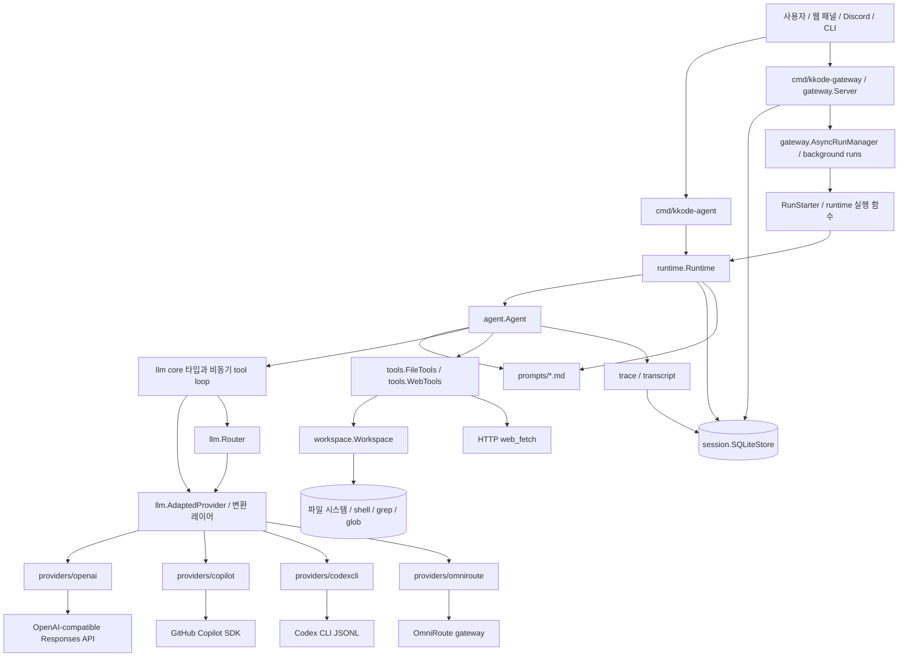
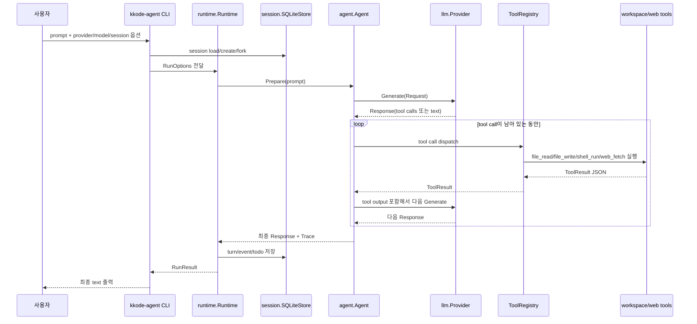
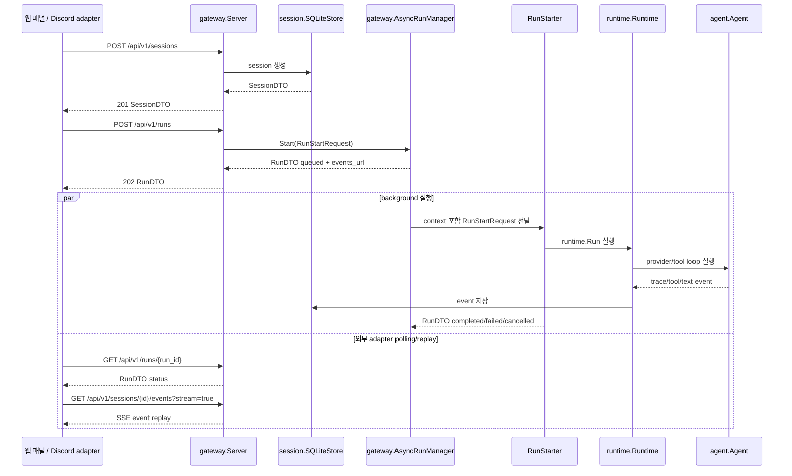
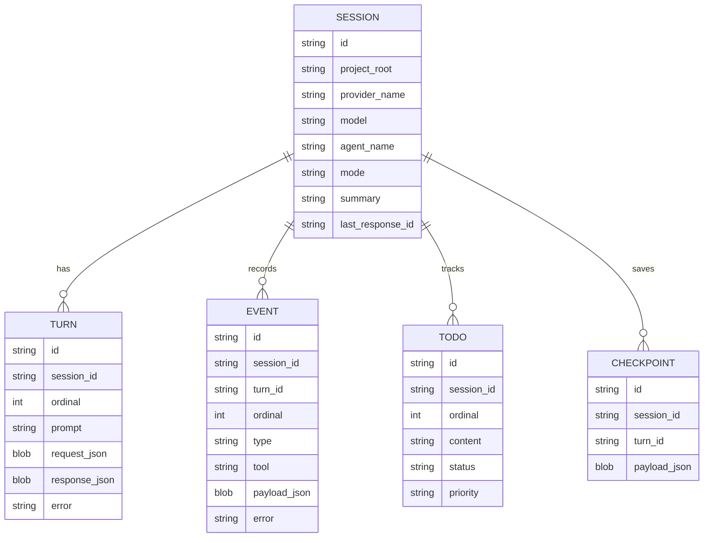

# kkode

`kkode`는 Go로 만드는 바이브코딩 앱의 provider 런타임 기반이에요. 목표는 OpenAI, GitHub Copilot SDK, Codex CLI, OmniRoute 같은 서로 다른 provider를 하나의 공통 타입 체계로 묶는 거예요.

기본 호환 기준은 **OpenAI Responses API**로 잡았어요. 그래서 단순 chat message만 다루지 않고 reasoning item, tool call, tool output, provider raw item을 최대한 보존해요. 이렇게 해야 tool loop, account rotation, Copilot/Codex 같은 agent runtime을 같은 앱 안에서 안전하게 이어 붙일 수 있어요.


## 프로젝트 틀과 작동 플로우

`kkode`의 큰 틀은 **OpenAI-compatible core → provider adapter → agent runtime → session/gateway surface** 순서로 흘러가요. CLI, 웹 패널, Discord 같은 외부 인터페이스는 모두 같은 runtime과 SQLite session store를 공유하도록 설계해요.

### 전체 구성 그래프



### Agent 실행 플로우



### Gateway / 외부 연동 플로우



### 저장되는 상태



요약하면, 모델별 차이는 `providers/*`에 가두고, 앱의 나머지 부분은 `llm.Request`, `llm.Response`, `ToolCall`, `session.Event` 같은 공통 타입만 보게 해요. 그래서 나중에 Copilot, Codex, OpenAI, OmniRoute, 자체 gateway provider를 바꿔 끼워도 agent/session/gateway 플로우는 유지돼요.

## 지금 구현된 것

### 앱 조립: `app/`

- `app.ProviderSpecs`, `app.BuildProvider`, `app.NewWorkspace`, `app.NewAgent`, `app.NewRuntime`, `tools.StandardTools`가 CLI/gateway의 중복 조립 코드를 줄여요.
- `app.DefaultProviderOptions`가 Serena와 Context7 MCP를 기본 provider option으로 합쳐요. `ProviderHandle.BaseRequest`는 OpenAI-compatible HTTP MCP를 built-in `mcp` tool로 전달하고, Copilot은 stdio/http MCP를 SDK session config로 전달해요. `KKODE_DEFAULT_MCP=off`로 끌 수 있고, `KKODE_SERENA_COMMAND`, `KKODE_SERENA_ARGS`, `KKODE_CONTEXT7_URL`, `CONTEXT7_API_KEY`로 실행 환경에 맞게 바꿀 수 있어요.
- agent 표면에는 표준 `file_*`, `shell_run`, `web_fetch` tool만 붙이고, 이전 `workspace_*` tool 자동 주입은 하지 않아요.

### Prompt 템플릿: `prompts/`

- `agent-system.md`, `session-summary-context.md`, `session-compaction.md`, `todo-instructions.md`를 파일로 관리해요.
- `prompts.Render`가 Go `text/template` 기반으로 system prompt, session 압축 요약, todo 지침을 렌더링하고 template parse 결과를 캐시해요.
- prompt 문구는 코드가 아니라 `prompts/*.md`를 수정해서 바꿀 수 있어요.

### Agent runtime: `agent/`

- `agent.Agent`가 provider, 표준 tool, guardrail, transcript, trace event를 묶어서 실제 coding agent loop를 실행해요.
- `session.SQLiteStore`와 `runtime.Runtime`이 session resume/fork, turn/event/todo 저장을 담당해요.
- OpenAI-compatible Responses tool loop를 기본으로 쓰고, provider별 adapter는 `llm.Provider`만 구현하면 붙일 수 있어요.
- `cmd/kkode-agent` CLI로 prompt, provider, model, workspace root, session ID를 넘겨 바로 실행할 수 있어요.
- `gateway.Server`와 `cmd/kkode-gateway`가 session/run/event/todo를 HTTP API로 노출해서 웹 패널이나 Discord adapter가 같은 runtime state를 재사용할 수 있게 해요. Todo는 조회뿐 아니라 replace/upsert/delete도 API로 조정할 수 있어요.

### Core: `llm/`

- `Provider`, `StreamProvider`, `SessionProvider`를 제공해요.
- `Request`, `Response`, `Message`, `Item`으로 provider 공통 입출력을 표현해요.
- `RequestConverter`, `ResponseConverter`, `ProviderCaller`, `AdaptedProvider`로 `요청 DTO → provider별 변환 → API/source 호출 → 표준 응답` 흐름을 재사용해요. 새 provider는 표준 `llm.Request`를 직접 오염시키지 말고 converter와 caller를 추가하는 방향으로 붙이면 돼요.
- `Tool`, `ToolCall`, `ToolResult`, `ToolRegistry`, `ToolMiddleware`, `RunToolLoop`로 tool 실행 루프를 처리해요. 여러 tool call은 옵션이 켜져 있으면 상한 안에서 비동기로 실행하고 결과 순서는 보존해요.
- `ReasoningConfig`, `ReasoningItem`으로 thinking/reasoning 정보를 보존해요.
- `TextFormat`으로 structured output 설정을 표현해요.
- `Auth`, `Model`, `ModelRegistry`, `Usage.EstimatedCost`를 제공해요.
- `ToolRegistry.WithMiddleware`로 tracing, timeout, metric, redaction 같은 tool 실행 전후 처리를 agent와 gateway가 같은 방식으로 감쌀 수 있어요.
- `Router`, `Template`, `RedactSecrets`도 포함해요.

### Providers

- `providers/openai`
  - OpenAI-compatible `/v1/responses` provider예요.
  - `ResponsesConverter`가 표준 request/response와 Responses payload 사이를 변환하고, `Client`가 API caller 역할을 해요.
  - SSE streaming, retry/backoff, built-in tool helper, response parsing을 제공해요.
  - `providers/internal/httptransport`의 JSON request/header/retry/SSE framing helper를 써서 파생 provider와 HTTP 처리 방식을 공유해요.
- `providers/copilot`
  - GitHub Copilot SDK session adapter예요.
  - `SessionConverter`가 표준 request를 SDK session prompt payload로 바꾸고, `Client`가 SDK caller 역할을 해요.
  - session, streaming event 변환, custom tool, MCP/custom agent/skill mapping을 제공해요.
- `providers/codexcli`
  - `codex exec --json` subprocess adapter예요.
  - `ExecConverter`가 표준 request를 CLI prompt 실행 payload로 바꾸고, `Client`가 subprocess caller 역할을 해요.
  - JSONL event stream을 `llm.StreamEvent`로 바꿔요.
- `providers/omniroute`
  - OmniRoute gateway adapter예요.
  - `/v1/responses` 또는 OpenAPI 기준 `/api/v1/responses`를 사용할 수 있어요.
  - generation은 `providers/openai`를 감싸고, management/A2A 호출은 같은 내부 HTTP transport helper를 써요.
  - model list, health, thinking budget, fallback chain, cache/rate/session, translator, A2A helper를 제공해요.

### Gateway API: `gateway/`

- `gateway.Server`는 `net/http` 기반 API server예요. 외부 의존성 없이 `/api/v1` REST surface를 만들어요.
- `GET /healthz`, `GET /readyz`, `GET /api/v1`, `GET /api/v1/openapi.yaml`, `GET /api/v1/version`, `GET /api/v1/capabilities`, `GET /api/v1/diagnostics`, `GET /api/v1/providers`, `GET /api/v1/models`, `GET /api/v1/stats`를 제공해요.
- `POST /api/v1/sessions`, `GET /api/v1/sessions`, `GET /api/v1/sessions/{id}`, `GET /api/v1/sessions/{id}/turns`, `GET /api/v1/sessions/{id}/turns/{turn_id}`, `GET /api/v1/sessions/{id}/transcript`, `POST /api/v1/sessions/{id}/compact`, `POST /api/v1/sessions/{id}/fork`를 제공해요.
- `GET /api/v1/sessions/{id}/turns`는 대화 turn 목록과 response text/usage를 반환하고, `GET /api/v1/sessions/{id}/transcript`는 외부 패널/Discord 메시지가 바로 렌더링할 수 있는 markdown transcript를 반환하고, `POST /api/v1/sessions/{id}/compact`는 오래된 turn을 session summary로 압축해요. `GET /api/v1/sessions/{id}/events`는 `after_seq`와 `limit` 기반 JSON replay와 `stream=true` SSE replay를 지원해요. SQLite store에서는 `TimelineStore`가 turn/event 범위만 직접 읽어서 긴 세션도 전체 JSON을 매번 로드하지 않고, `TurnEventStore`가 새 turn/event와 session metadata를 한 transaction으로 append/update해서 run 저장 시 전체 session 재작성을 피하게 해요.
- `GET /api/v1/sessions/{id}/todos`로 웹 패널/Discord status에 필요한 todo를 읽어요.
- `POST /api/v1/runs`는 `gateway.AsyncRunManager`로 즉시 접수하고 background에서 실제 agent run을 실행해요. run 상태는 SQLite에도 저장돼서 gateway 재시작 뒤에도 조회할 수 있어요. gateway 시작 시 소유자가 사라진 `queued/running/cancelling` run은 `failed`로 닫아서 외부 패널이 영원히 도는 작업을 보지 않게 해요. run 레코드는 provider/model/MCP/skills/subagents 선택도 보존해서 retry와 패널 표시가 같은 실행 맥락을 유지해요. `GET /api/v1/runs/{id}/events?stream=true`로 run 상태 변경을 live SSE로 받을 수 있어요.
- `GET /api/v1/runs`, `GET /api/v1/runs/{id}`, `GET /api/v1/runs/{id}/events`, `POST /api/v1/runs/{id}/cancel`, `POST /api/v1/runs/{id}/retry`로 외부 adapter가 run 상태를 조회하고 취소/재시도할 수 있어요. `GET /api/v1/runs?request_id=...` 또는 `GET /api/v1/requests/{request_id}/runs`로 특정 웹/Discord 요청에서 만들어진 run만 다시 찾을 수 있고, `GET /api/v1/requests/{request_id}/events`로 그 run들의 event replay를 한 번에 읽고, `stream=true`로 live SSE까지 이어 받을 수 있어요. SQLite는 해당 metadata JSON 경로에 expression index를 둬서 대시보드 조회 비용을 줄여요. Run 상태 변경 event는 SQLite에 저장돼서 gateway 재시작 뒤에도 `after_seq` 기준으로 replay할 수 있어요. SQLite store는 `SaveRunWithEvent`로 run snapshot과 durable event를 같은 transaction에 남겨서 상태와 replay가 갈라지지 않게 해요. session turn/event ordinal과 run event seq에는 unique index와 짧은 retry가 붙어서 동시 append 경합을 줄여요.
- `GET/POST /api/v1/sessions/{id}/checkpoints`, `GET /api/v1/sessions/{id}/checkpoints/{checkpoint_id}`는 외부 adapter가 복구용 snapshot payload를 저장하고 다시 읽게 해요.
- `GET /api/v1`은 외부 adapter가 OpenAPI/capabilities/session/run 같은 대표 link를 한 번에 발견하게 해요. `KKODE_CORS_ORIGINS` 또는 `-cors-origins`를 지정하면 별도 웹 패널 origin에서 bearer auth API를 호출할 수 있어요. 모든 gateway 응답은 `X-Request-Id`를 보존하거나 생성해서 웹 패널/Discord 로그와 오류 envelope를 같은 요청으로 묶을 수 있게 해요. host app은 `gateway.AccessLogger`를 주입해서 같은 request id, method, path, status, byte 수, duration을 structured log나 metric으로 받을 수 있고, `POST /api/v1/runs/preview`는 실행 없이 provider/model/default MCP/선택 manifest/base request tool 조립 결과를 보여주고, `POST /api/v1/runs`와 retry 요청은 같은 값을 run metadata의 `request_id`로 남겨요. `GET /api/v1/openapi.yaml`은 외부 adapter와 SDK generator가 현재 API 계약을 내려받게 해요. `GET /api/v1/capabilities`는 sessions/events/todos/background_runs/models/prompts/MCP/skills/subagents/LSP의 현재 지원 상태, 기본 Serena/Context7 MCP manifest, `limits.max_request_bytes`를 외부 adapter가 발견할 수 있게 해요. `GET /api/v1/diagnostics`는 store ping, run starter/previewer 연결, provider/default MCP 개수 같은 배포 진단값을 한 번에 보여줘요. default MCP discovery/preview 응답은 header/env secret 값을 마스킹해요. `GET /api/v1/stats`는 dashboard가 sessions/turns/events/runs/resources 카운트를 한 번에 그리게 해요.
- `GET /api/v1/models`는 provider별 모델 catalog, 기본 모델, capability, auth 상태를 반환해서 외부 adapter가 모델 선택 UI를 만들게 해요.
- `GET /api/v1/prompts`, `GET /api/v1/prompts/{name}`, `POST /api/v1/prompts/{name}/render`는 system/session/todo prompt template을 외부 패널에서 확인하고 preview할 수 있게 해요.
- `GET/POST/PUT/DELETE /api/v1/mcp/servers`, `/api/v1/skills`, `/api/v1/subagents`는 외부 adapter가 실행 자산 manifest를 SQLite에 저장하고 재사용하게 해요. `POST /api/v1/runs`의 `mcp_servers`, `skills`, `subagents` ID 목록으로 선택한 manifest를 provider 설정에 반영해요. `GET /api/v1/skills/{id}/preview`는 SKILL.md/README.md 내용을 웹 패널에서 보여줄 수 있게 하고, `GET /api/v1/subagents/{id}/preview`는 prompt/tools/skills/MCP 연결을 실행 전 확인하게 해요. `GET /api/v1/mcp/servers/{id}/tools`, `/resources`, `/prompts`는 stdio MCP server를 probe해서 `tools/list`, `resources/list`, `prompts/list` 결과를 확인해요. `/resources/read`와 `/prompts/{prompt}/get`은 MCP resource/prompt 내용을 직접 가져오고, `POST /api/v1/mcp/servers/{id}/tools/{tool}/call`은 디버그/웹 패널에서 저장된 stdio MCP tool을 직접 호출해요.
- `GET /api/v1/lsp/symbols?project_root=...&query=...`는 files/git API와 같은 workspace root 검증을 거친 뒤 웹 패널 코드 탐색을 위한 Go workspace symbol 검색을 제공해요. `GET /api/v1/lsp/document-symbols?project_root=...&path=...`는 파일 outline을 반환하고, `GET /api/v1/lsp/definitions?symbol=...`와 `GET /api/v1/lsp/references?symbol=...`는 definition/reference 위치를 반환해요. `GET /api/v1/lsp/diagnostics`와 `GET /api/v1/lsp/hover`는 parse diagnostic과 symbol hover 문서를 제공해요.
- `GET /api/v1/tools`, `POST /api/v1/tools/call`은 웹 패널/Discord adapter가 agent run 없이도 `file_read`, `file_write`, `file_edit`, `file_apply_patch`, `file_list`, `file_glob`, `file_grep`, `shell_run`, `web_fetch`를 직접 실행하게 해요. 권한 프롬프트 없이 바로 실행하는 YOLO API예요.
- `GET /api/v1/git/status`, `/git/diff`, `/git/log`는 웹 패널이 변경 파일, diff, 최근 commit을 바로 렌더링하게 해요.
- `GET /api/v1/files`, `GET/PUT /api/v1/files/content`는 웹 패널 파일 브라우저용 목록/읽기/쓰기 API예요. 내부적으로 workspace 경계를 재사용해요.
- `gateway/openapi.yaml`에 현재 API 계약을 기록해요.

### App support

- `cmd/kkode-agent`
  - OpenAI, OmniRoute, Copilot SDK, Codex CLI provider를 같은 CLI에서 실행해요.
  - 즉시 실행형 workspace라 파일 쓰기와 shell 실행을 바로 열어요.
  - 기본적으로 `.kkode/state.db` SQLite DB에 session/turn/event/todo를 저장하고, `-session`, `-fork-session`, `-list-sessions`로 이어갈 수 있어요.
- `session`
  - SQLite 기반 session store, resume/fork, turn/event/todo/checkpoint 저장 인터페이스를 제공해요.
- `runtime`
  - `agent.Agent`와 `session.Store`를 묶어 multi-turn runtime을 실행해요.
- `tools`
  - agent가 바로 쓰기 좋은 표준 tool 이름을 제공해요: `file_read`, `file_write`, `file_edit`, `file_apply_patch`, `file_list`, `file_glob`, `file_grep`, `shell_run`, `web_fetch`.
  - `web_fetch`는 HTTP/HTTPS URL을 가져와 status, content type, body, truncate 여부를 JSON으로 돌려줘요.
- `workspace`
  - workspace path boundary, read-range/write/replace/apply-patch/list/glob/grep/search/shell tool을 제공해요.
  - shell 실행은 stdout 문자열뿐 아니라 exit code, stderr, timeout 여부를 구조화해서 tool output으로 돌려줘요.
- `transcript`
  - request/response/error turn을 JSON으로 저장해요.
  - secret redaction 저장도 지원해요.

## Agent CLI 예제

기본 실행 모드로 저장소를 조사하거나 수정하게 할 때는 이렇게 실행해요.

```bash
go run ./cmd/kkode-agent \
  -provider openai \
  -model gpt-5-mini \
  -root . \
  "이 저장소 구조를 요약해줘"
```

이 프로젝트는 별도 권한/읽기 전용 모드를 두지 않아요. agent가 요청한 파일 작업과 shell 실행은 workspace root 안에서 바로 실행돼요.

Codex 구독/CLI adapter를 쓰는 경우에는 provider만 바꾸면 돼요.

```bash
go run ./cmd/kkode-agent \
  -provider codex \
  -model gpt-5.3-codex \
  -root . \
  "README.md의 개선점을 알려줘"
```

저장된 session은 이렇게 이어가요.

```bash
go run ./cmd/kkode-agent -list-sessions
go run ./cmd/kkode-agent \
  -session sess_... \
  -provider codex \
  -model gpt-5.3-codex \
  "이전 맥락을 이어서 다음 작업을 해줘"
```

실험 branch처럼 대화를 분기하려면 이렇게 해요.

```bash
go run ./cmd/kkode-agent \
  -fork-session sess_... \
  -fork-at turn_... \
  "이 지점부터 다른 접근으로 구현해줘"
```


## Gateway API 예제

로컬 웹 패널이나 Discord adapter가 session state를 읽게 하려면 gateway를 실행해요. 기본 listen 주소는 localhost라 개발 중에는 안전하게 시작할 수 있어요. `/readyz`는 SQLite store가 ping 가능한지도 확인해서 배포 readiness probe로 쓸 수 있어요.

```bash
go run ./cmd/kkode-gateway \
  -addr 127.0.0.1:41234 \
  -state .kkode/state.db
```

원격 bind는 file/shell/web tool surface를 외부에 여는 것이므로 API key가 필요해요.

```bash
KKODE_API_KEY=kk_live_local \
KKODE_CORS_ORIGINS=https://panel.example \
KKODE_ACCESS_LOG=1 \
  go run ./cmd/kkode-gateway \
  -addr 0.0.0.0:41234 \
  -api-key-env KKODE_API_KEY
```

별도 웹 패널 origin이 있으면 `KKODE_CORS_ORIGINS` 또는 `-cors-origins`에 쉼표로 나열해요. 실제 API 호출은 여전히 bearer token을 써야 해요. 외부 adapter가 `X-Request-Id`를 보내면 gateway가 그대로 응답 header와 오류 body에 보존하고, 없으면 `req_...` 형식으로 생성해요. Background run을 시작하거나 retry할 때도 같은 값이 run metadata의 `request_id`에 들어가서 run event replay에서 추적할 수 있어요. `KKODE_ACCESS_LOG=1` 또는 `-access-log`를 켜면 request id, method, path, status, byte 수, duration을 JSONL로 stderr에 남겨요. `KKODE_MAX_BODY_BYTES` 또는 `-max-body-bytes`는 JSON API 요청 body 최대 크기를 조절해요. `KKODE_READ_HEADER_TIMEOUT`, `KKODE_READ_TIMEOUT`, `KKODE_WRITE_TIMEOUT`, `KKODE_IDLE_TIMEOUT`, `KKODE_SHUTDOWN_TIMEOUT` 또는 대응 flag로 HTTP timeout을 배포 환경에 맞게 조절해요. `cmd/kkode-gateway`는 SIGINT/SIGTERM을 받으면 진행 중 HTTP 요청을 위해 graceful shutdown을 시도하고, 소유 중인 background run도 취소 상태로 저장해요.

session 생성 예시는 다음과 같아요.

```bash
curl -X POST http://127.0.0.1:41234/api/v1/sessions \
  -H 'Content-Type: application/json' \
  -d '{"project_root":"/home/user/kkode","provider":"openai","model":"gpt-5-mini","agent":"web-panel"}'
```

모델 선택 UI는 model catalog API를 먼저 읽으면 돼요.

```bash
curl 'http://127.0.0.1:41234/api/v1'
curl 'http://127.0.0.1:41234/api/v1/openapi.yaml'
curl 'http://127.0.0.1:41234/api/v1/models?provider=openai'
curl 'http://127.0.0.1:41234/api/v1/prompts'
```

저장해둔 MCP server, skill, subagent manifest를 골라 background run에 붙일 수 있어요. 응답은 즉시 `202 Accepted`와 `run_id`를 돌려주고, 실제 agent 실행은 gateway 내부 goroutine에서 이어져요.

```bash
curl -X POST http://127.0.0.1:41234/api/v1/runs \
  -H 'Content-Type: application/json' \
  -d '{
    "session_id":"sess_...",
    "prompt":"이 저장소 구조를 요약하고 다음 작업을 추천해줘",
    "provider":"copilot",
    "model":"gpt-5-mini",
    "mcp_servers":["mcp_..."],
    "skills":["skill_..."],
    "subagents":["subagent_..."],
    "metadata":{"source":"web-panel"}
  }'
```

run 상태와 상태 변경 SSE는 아래처럼 읽어요. `events_url`은 session event replay URL이라서 최종 tool/event log를 따라갈 때 같이 쓰면 돼요.

```bash
curl http://127.0.0.1:41234/api/v1/runs/run_...
curl 'http://127.0.0.1:41234/api/v1/runs/run_.../events?after_seq=0&limit=200'
curl -N 'http://127.0.0.1:41234/api/v1/runs/run_.../events?stream=true&after_seq=0'
curl -X POST http://127.0.0.1:41234/api/v1/mcp/servers/mcp_.../tools/echo/call \
  -H 'Content-Type: application/json' \
  -d '{"arguments":{"text":"ping"}}'
curl -X POST http://127.0.0.1:41234/api/v1/tools/call \
  -H 'Content-Type: application/json' \
  -d '{"project_root":"/home/user/kkode","tool":"file_read","arguments":{"path":"README.md","max_bytes":4096}}'
curl 'http://127.0.0.1:41234/api/v1/files?project_root=/home/user/kkode&path=.'
curl 'http://127.0.0.1:41234/api/v1/files/content?project_root=/home/user/kkode&path=README.md&max_bytes=4096'
curl -X POST http://127.0.0.1:41234/api/v1/sessions/sess_.../todos \
  -H 'Content-Type: application/json' \
  -d '{"content":"웹 패널에서 상태를 확인해요","status":"in_progress"}'
curl -X POST http://127.0.0.1:41234/api/v1/sessions/sess_.../checkpoints \
  -H 'Content-Type: application/json' \
  -d '{"turn_id":"turn_...","payload":{"summary":"복구 지점이에요"}}'
curl 'http://127.0.0.1:41234/api/v1/sessions/sess_.../turns?limit=50'
curl http://127.0.0.1:41234/api/v1/sessions/sess_.../events
curl -N 'http://127.0.0.1:41234/api/v1/sessions/sess_.../events?stream=true&after_seq=0'
```

OpenAPI 계약은 `gateway/openapi.yaml`을 참고해요. `go test ./gateway`에는 feature catalog endpoint가 OpenAPI paths에 계속 존재하는지 확인하는 계약 테스트도 들어 있어요.

## 빠른 검증

```bash
go test ./...
go vet ./...
```

추가 smoke test는 이렇게 실행해요.

```bash
./scripts/verify-go-examples.sh
./scripts/copilot-smoke.sh gpt-5-mini
./scripts/copilot-tool-smoke.sh gpt-5-mini
./scripts/codexcli-smoke.sh gpt-5.3-codex
./scripts/omniroute-smoke.sh   # OmniRoute가 안 떠 있으면 SKIP 처리해요
```

OpenAI live test는 `OPENAI_API_KEY`가 있을 때만 실행해야해요.

```bash
OPENAI_API_KEY=... OPENAI_TEST_MODEL=gpt-5-mini go test ./providers/openai -run Live
```

## OpenAI-compatible 예제

```go
client := openai.New(openai.Config{
    APIKey: os.Getenv("OPENAI_API_KEY"),
    // OmniRoute 같은 파생 provider는 ProviderName으로 stream/response label을 고정할 수 있어요.
    // ProviderName: "my-openai-compatible-gateway",
})

resp, err := client.Generate(ctx, llm.Request{
    Model:        "gpt-5-mini",
    Instructions: "코딩 어시스턴트처럼 답변해요.",
    Messages: []llm.Message{
        llm.UserText("리팩터링 계획을 만들어줘"),
    },
    Reasoning: &llm.ReasoningConfig{
        Effort:  "medium",
        Summary: "auto",
    },
})
if err != nil {
    panic(err)
}
fmt.Println(resp.Text)
```

## Tool 예제

agent에는 기본적으로 표준 tool 이름을 붙이면 좋아요.

```go
ws, err := workspace.New(".")
if err != nil {
    panic(err)
}

toolDefs, toolHandlers := tools.StandardTools(tools.SurfaceOptions{
    Workspace:   ws,
    WebMaxBytes: 1 << 20,
})

ag, err := agent.New(agent.Config{
    Provider:     provider,
    Model:        "gpt-5-mini",
    Tools:        toolDefs,
    ToolHandlers: toolHandlers,
})
```

직접 workspace API를 써도 돼요.

```go
text, err := ws.ReadFileRange("src/main.go", workspace.ReadOptions{
    OffsetLine: 1,
    LimitLines: 80,
})
_ = text

matches, err := ws.Grep("TODO", workspace.GrepOptions{PathGlob: "**/*.go"})
_ = matches

result, err := ws.RunDetailed(ctx, "go", []string{"test", "./..."}, workspace.CommandOptions{})
_ = result
```

## Tool loop 예제

```go
registry := llm.ToolRegistry{
    "echo": llm.JSONToolHandler(func(ctx context.Context, in struct {
        Text string `json:"text"`
    }) (string, error) {
        return in.Text, nil
    }),
}

resp, err := llm.RunToolLoop(ctx, client, req, registry, llm.ToolLoopOptions{
    MaxIterations:        8,
    ParallelToolCalls:    true,
    MaxParallelToolCalls: 4,
})
```

## Router 예제

```go
router := llm.NewRouter()
router.Register("openai", openai.New(openai.Config{APIKey: openAIKey}))
router.Register("copilot", copilot.New(copilot.Config{}))
router.Register("codex", codexcli.New(codexcli.Config{Ephemeral: true}))
router.Register("omniroute", omniroute.NewFromGatewayBase("http://localhost:20128", omniroute.Config{}))

resp, err := router.Generate(ctx, llm.Request{
    Model: "omniroute/auto",
    Messages: []llm.Message{
        llm.UserText("이 저장소를 분석하고 다음 작업을 추천해줘"),
    },
})
```

## 문서

- [`ARCHITECTURE.md`](ARCHITECTURE.md) — 파일 트리, 구현체, 함수 시그니처, 예제를 정리해요.
- [`research/`](research/) — 외부 문서 조사와 구현 판단을 저장해요.
- [`research/08-omniroute-provider.md`](research/08-omniroute-provider.md) — OmniRoute API/MCP/A2A/OpenAPI 조사 내용을 정리해요.
- [`research/09-agent-runtime-hardening.md`](research/09-agent-runtime-hardening.md) — 실제 agent 실행을 위한 tool loop, guardrail, trace, workspace 강화 조사 내용을 정리해요.

## 작업 규칙

앞으로 문서와 주석은 한글 해요체로 작성하고 `~해요`, `~할게요`, `~해야해요` 말투를 유지할게요. 기술 용어는 원문을 유지하고, 새 `research/*.md`와 `suggest/*.md` 파일은 numbered-kebab-case 이름을 쓸게요. 의미 있는 작업 단위가 끝나면 테스트를 돌리고 커밋/푸시까지 할게요.
