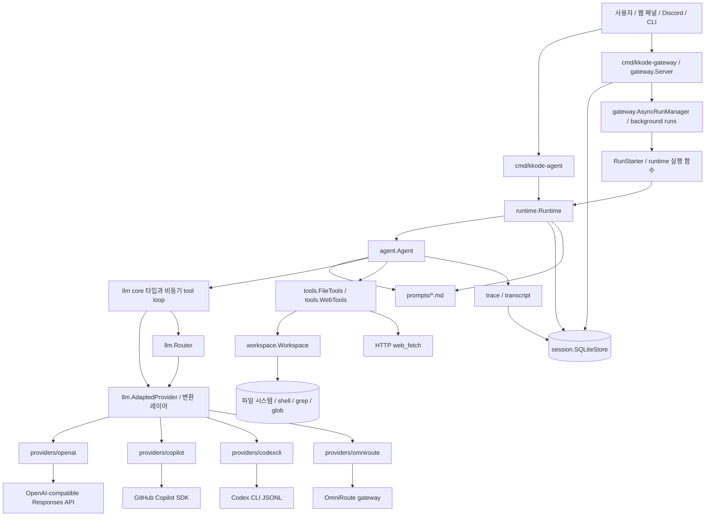
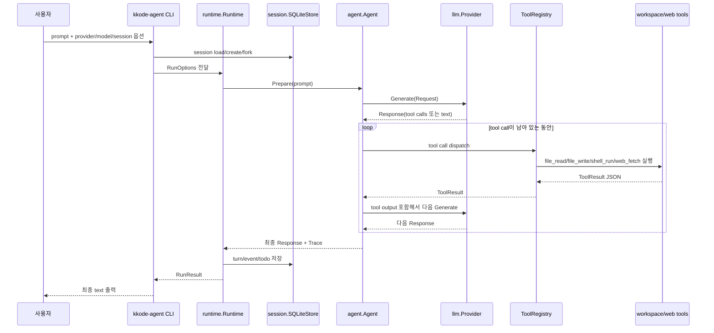
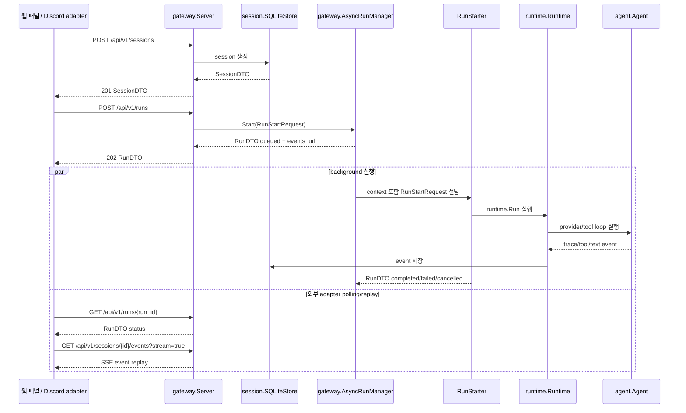
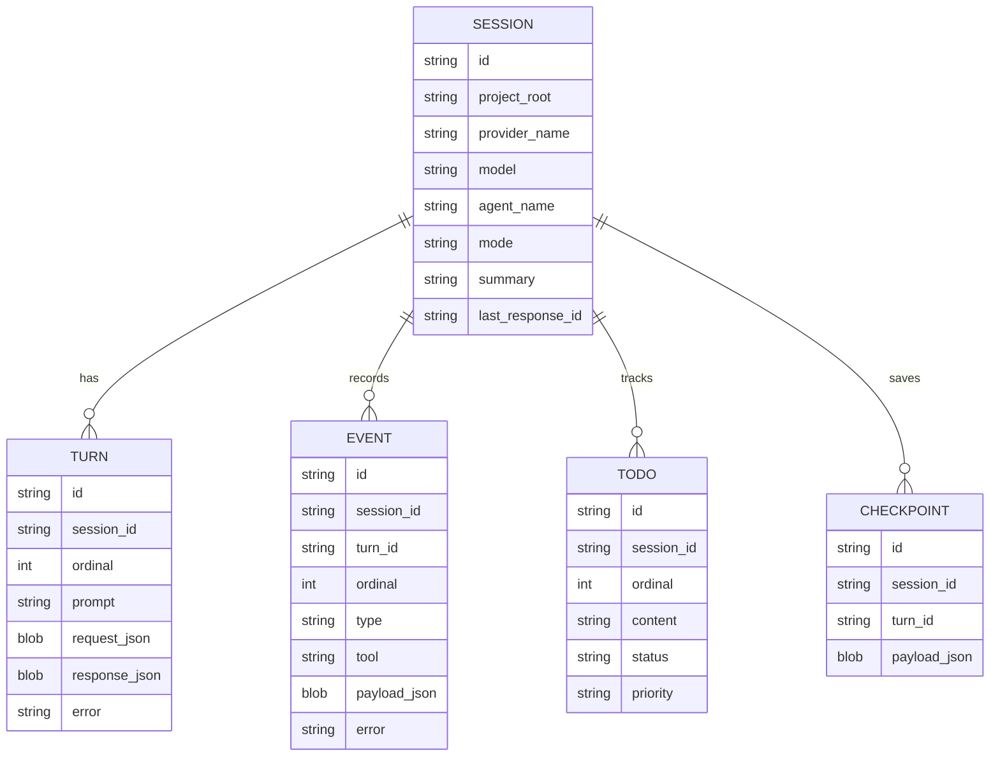

# kkode

`kkode`는 Go로 만드는 바이브코딩 앱의 provider 런타임 기반이에요. 목표는 OpenAI, GitHub Copilot SDK, Codex CLI, OmniRoute 같은 서로 다른 provider를 하나의 공통 타입 체계로 묶는 거예요.

기본 호환 기준은 **OpenAI Responses API**로 잡았어요. 그래서 단순 chat message만 다루지 않고 reasoning item, tool call, tool output, provider raw item을 최대한 보존해요. 이렇게 해야 tool loop, account rotation, Copilot/Codex 같은 agent runtime을 같은 앱 안에서 안전하게 이어 붙일 수 있어요.


## 프로젝트 틀과 작동 플로우

`kkode`의 큰 틀은 **OpenAI-compatible core → provider adapter → agent runtime → session/gateway surface** 순서로 흘러가요. CLI, 웹 패널, Discord 같은 외부 인터페이스는 모두 같은 runtime과 SQLite session store를 공유하도록 설계해요.

### 전체 구성 그래프



### Agent 실행 플로우



### Gateway / 외부 연동 플로우



### 저장되는 상태



요약하면, 모델별 차이는 `providers/*`에 가두고, 앱의 나머지 부분은 `llm.Request`, `llm.Response`, `ToolCall`, `session.Event` 같은 공통 타입만 보게 해요. 그래서 나중에 Copilot, Codex, OpenAI, OmniRoute, 자체 gateway provider를 바꿔 끼워도 agent/session/gateway 플로우는 유지돼요.

## 지금 구현된 것

### 앱 조립: `app/`

- `app.ProviderSpecs`, `app.BuildProvider`, `app.RegisterHTTPJSONProvider`, `app.BuildHTTPJSONProviderAdapter`, `app.NewWorkspace`, `app.NewAgent`, `app.NewRuntime`, `tools.StandardTools`가 CLI/gateway의 중복 조립 코드를 줄여요. Provider spec에는 converter/caller/source/operation/HTTP route 변환 profile도 들어 있어서 외부 패널이 provider가 어떤 방식으로 실행되는지 discovery할 수 있어요.
- `app.DefaultProviderOptions`가 Serena와 Context7 MCP를 기본 provider option으로 합쳐요. `ProviderHandle.BaseRequest`는 OpenAI-compatible HTTP MCP를 built-in `mcp` tool로 전달하고, Copilot은 stdio/http MCP를 SDK session config로 전달해요. `MCPToolsFromProviderOptions`는 같은 manifest에서 OpenAI-compatible hosted MCP tool과 local `mcp_call` toolset을 함께 만들어서 provider 기본 request와 agent local MCP surface가 서로 다른 설정을 보지 않게 해요. `KKODE_DEFAULT_MCP=off`로 끌 수 있고, `KKODE_SERENA_COMMAND`, `KKODE_SERENA_ARGS`, `KKODE_CONTEXT7_URL`, `CONTEXT7_API_KEY`로 실행 환경에 맞게 바꿀 수 있어요.
- agent 표면에는 표준 `file_*`, `shell_run`, `web_fetch` tool만 붙이고, 이전 `workspace_*` tool 자동 주입은 하지 않아요.

### Prompt 템플릿: `prompts/`

- `agent-system.md`, `session-summary-context.md`, `session-compaction.md`, `todo-instructions.md`를 파일로 관리해요.
- `prompts.Render`가 Go `text/template` 기반으로 system prompt, session 압축 요약, todo 지침을 렌더링하고 template parse 결과를 캐시해요.
- prompt 문구는 코드가 아니라 `prompts/*.md`를 수정해서 바꿀 수 있어요.

### Agent runtime: `agent/`

- `agent.Agent`가 provider, 표준 tool, guardrail, transcript, trace event를 묶어서 실제 coding agent loop를 실행해요. Guardrail은 substring 차단뿐 아니라 `GuardrailPolicy`와 `JSONRequiredFieldsPolicy`로 adapter별 출력 schema/policy 검사를 붙일 수 있고, `OTelObserver`/`GlobalOTelObserver`로 trace event를 OpenTelemetry span으로 내보낼 수 있어요.
- `session.SQLiteStore`와 `runtime.Runtime`이 session resume/fork, turn/event/todo 저장을 담당해요.
- OpenAI-compatible Responses tool loop를 기본으로 쓰고, provider별 adapter는 `llm.Provider`만 구현하면 붙일 수 있어요.
- `cmd/kkode-agent` CLI로 prompt, provider, model, workspace root, session ID를 넘겨 바로 실행할 수 있어요.
- `gateway.Server`와 `cmd/kkode-gateway`가 session/run/event/todo를 HTTP API로 노출해서 웹 패널이나 Discord adapter가 같은 runtime state를 재사용할 수 있게 해요. Todo는 조회뿐 아니라 replace/upsert/delete도 API로 조정할 수 있어요.

### Core: `llm/`

- `Provider`, `StreamProvider`, `SessionProvider`를 제공해요.
- `Request`, `Response`, `Message`, `Item`으로 provider 공통 입출력을 표현해요.
- `RequestConverter`, `ResponseConverter`, `ProviderCaller`, `ProviderStreamCaller`, `ProviderPipeline`, `AdaptedProvider`로 `요청 DTO → provider별 변환 → API/source 호출 → 표준 응답/stream` 흐름을 재사용해요. `ProviderPipeline.Prepare/Call/Decode`를 따로 쓸 수 있어서 preview API, debug UI, 실제 실행이 같은 변환 규칙을 공유해요. 새 provider는 표준 `llm.Request`를 직접 오염시키지 말고 converter와 caller를 추가하는 방향으로 붙이면 돼요. 양방향 `Converter` 하나를 써도 되고 request/response converter를 분리해 OpenAI-compatible 요청 builder, 다른 API caller, 별도 response parser를 조합해도 돼요. Streaming source는 request converter와 stream caller만으로 붙일 수 있어요. OpenAI-compatible HTTP source는 `app.RegisterHTTPJSONProvider`로 source 설정만 등록해도 되고, 더 특수한 provider는 `app.RegisterProvider`로 spec/conversion/factory를 등록해서 core registry를 직접 수정하지 않고 추가할 수 있어요.
- `Tool`, `ToolCall`, `ToolResult`, `ToolRegistry`, `ToolMiddleware`, `RunToolLoop`로 tool 실행 루프를 처리해요. 여러 tool call은 옵션이 켜져 있으면 상한 안에서 비동기로 실행하고 결과 순서는 보존해요.
- `ReasoningConfig`, `ReasoningItem`으로 thinking/reasoning 정보를 보존해요.
- `TextFormat`으로 structured output 설정을 표현해요.
- `Auth`, `Model`, `ModelRegistry`, `Usage.EstimatedCost`를 제공해요.
- `ToolRegistry.WithMiddleware`로 tracing, timeout, metric, redaction 같은 tool 실행 전후 처리를 agent와 gateway가 같은 방식으로 감쌀 수 있어요.
- `Router`, `Template`, `RedactSecrets`도 포함해요.

### Providers

- `providers/openai`
  - OpenAI-compatible `/v1/responses` provider예요.
  - `ResponsesConverter`가 표준 request/response와 Responses payload 사이를 변환하고, `Client`가 API caller/stream caller 역할을 해요.
  - SSE streaming도 같은 변환 레이어를 거쳐서 retry/backoff, built-in tool helper, response parsing을 제공해요.
  - `providers/internal/httptransport`의 JSON request/header/retry/SSE framing helper를 써서 파생 provider와 HTTP 처리 방식을 공유해요. SSE event data도 event당 최대 4194304 byte envelope 안에서만 조립해요.
- `providers/copilot`
  - GitHub Copilot SDK session adapter예요.
  - `SessionConverter`가 표준 request를 SDK session prompt payload로 바꾸고, `Client`가 SDK caller 역할을 해요.
  - session, streaming event 변환도 공통 `AdaptedProvider` 경로로 처리하고, custom tool, MCP/custom agent/skill mapping을 제공해요. `AgentFromConfig`와 `CustomAgentConfigFromAgentConfig`로 provider-neutral `agent.Config`를 Copilot custom agent 정의로 재사용할 수 있어요.
  - SDK session send에서 누적하는 final response text는 최대 8388608 byte envelope로 제한해요.
- `providers/codexcli`
  - `codex exec --json` subprocess adapter예요.
  - `ExecConverter`가 표준 request를 CLI prompt 실행 payload로 바꾸고, `Client`가 subprocess caller 역할을 해요.
  - 단발 응답과 JSONL stream 모두 `ExecConverter`를 먼저 거친 뒤 `llm.StreamEvent`로 바꿔요.
  - 단발 output 파일과 streaming 누적 response text는 각각 최대 8388608 byte envelope로 제한해요.
- `providers/omniroute`
  - OmniRoute gateway adapter예요.
  - `/v1/responses` 또는 OpenAPI 기준 `/api/v1/responses`를 사용할 수 있어요.
  - generation은 `providers/openai`를 감싸고, management/A2A 호출은 같은 내부 HTTP transport helper를 써요.
  - model list, health, thinking budget, fallback chain, cache/rate/session, translator, A2A helper를 제공해요.
  - A2A artifact text는 최대 8388608 byte envelope 안에서만 합쳐요.

### Gateway API: `gateway/`

- `gateway.Server`는 `net/http` 기반 API server예요. 외부 의존성 없이 `/api/v1` REST surface를 만들어요.
- `GET /healthz`, `GET /readyz`, `GET /api/v1`, `GET /api/v1/openapi.yaml`, `GET /api/v1/version`, `GET /api/v1/capabilities`, `GET /api/v1/diagnostics`, `GET /api/v1/providers`, `GET /api/v1/providers/{provider}`, `POST /api/v1/providers/{provider}/test`, `GET /api/v1/models`, `GET /api/v1/stats`를 제공해요.
- `POST /api/v1/sessions`, `POST /api/v1/sessions/import`, `GET /api/v1/sessions`, `GET /api/v1/sessions/{id}`, `GET /api/v1/sessions/{id}/export`, `GET /api/v1/sessions/{id}/turns`, `GET /api/v1/sessions/{id}/turns/{turn_id}`, `GET /api/v1/sessions/{id}/transcript`, `POST /api/v1/sessions/{id}/compact`, `POST /api/v1/sessions/{id}/fork`를 제공해요. session 목록은 `project_root`, `provider`, `model`, `mode`, `limit`, `offset`으로 dashboard bucket에서 바로 좁히고 `total_sessions`로 page count를 계산할 수 있어요.
- `GET /api/v1/sessions/{id}/turns`는 대화 turn 목록과 response text/usage를 반환하고, `GET /api/v1/sessions/{id}/export`는 session, raw_session, counts, turns, events, todos, checkpoints, artifacts, runs, 참조된 MCP/skill/subagent resources를 한 JSON bundle로 묶어 복구/이관/debug에 쓰게 하고, preview 용도에서는 `include_raw=false`, `turn_limit`, `event_limit`, `checkpoint_limit`, `artifact_limit`, `run_limit`, `result_truncated`와 `checkpoints_truncated`/`artifacts_truncated`/`runs_truncated`로 응답 크기와 잘림 상태를 줄이고 확인할 수 있게 하며, `POST /api/v1/sessions/import`는 이 bundle의 raw_session/checkpoints/artifacts/runs/resources를 다시 저장해요. 공유/debug 용도는 `redact=true`로 raw_session을 제외하고 secret 패턴을 마스킹해요. `GET /api/v1/sessions/{id}/transcript`는 외부 패널/Discord 메시지가 바로 렌더링할 수 있는 markdown transcript를 반환하고 `max_markdown_bytes`, `markdown_bytes`, `markdown_truncated`로 큰 markdown preview 상태를 알려주며, `POST /api/v1/sessions/{id}/compact`는 오래된 turn을 session summary로 압축하고 `total_turns`, `compacted_turns`, `preserved_turns`, `summary_bytes`, `checkpoint_created`로 작업 결과를 알려줘요. `GET /api/v1/sessions/{id}/events`는 `type`, `after_seq`, `limit` 기반 JSON replay와 `stream=true` SSE replay를 지원해요. session turn/event list JSON 응답은 `limit`, `result_truncated`, 필요한 경우 `next_after_seq`를 포함하고, session/checkpoint/artifact list JSON 응답은 `total_checkpoints`/`total_artifacts`, `limit`, `offset`, `next_offset`, `result_truncated`를 포함해서 웹/Discord adapter가 다음 페이지나 replay cursor를 바로 계산하게 해요. SQLite store에서는 `TimelineStore`가 turn/event 범위만 직접 읽어서 긴 세션도 전체 JSON을 매번 로드하지 않고, `TurnEventStore`가 새 turn/event와 session metadata를 한 transaction으로 append/update해서 run 저장 시 전체 session 재작성을 피하게 해요.
- `GET /api/v1/sessions/{id}/todos`로 웹 패널/Discord status에 필요한 todo를 읽고 `status`, `limit`, `offset`으로 좁히며 `total_todos`, `next_offset`, `result_truncated`로 긴 todo 목록의 page 상태를 알려줘요.
- `POST /api/v1/runs`는 session/provider/resource/workspace/provider-factory preflight를 통과한 요청만 `gateway.AsyncRunManager`로 즉시 접수하고 background에서 실제 agent run을 실행해요. 요청 `metadata`는 run record뿐 아니라 provider `llm.Request.Metadata`까지 전달해서 OpenAI metadata, HTTP route template, 외부 trace/idempotency correlation에 같이 쓰게 해요. `max_output_tokens`는 run 단위 provider 출력 token 상한으로 전달되고 run record/retry에도 보존돼요. 완료된 run은 provider가 돌려준 `usage` token 집계와 `duration_ms` 실행 시간을 run record에도 노출해서 adapter가 turn 목록을 다시 읽지 않고 run dashboard와 비용/latency ledger를 만들 수 있어요. 취소/timeout context가 닫힌 run은 starter가 뒤늦게 성공 응답을 돌려줘도 `cancelled` 상태를 유지해요. `KKODE_MAX_CONCURRENT_RUNS`/`-max-concurrent-runs`는 동시에 running 상태로 진입하는 run 수를 제한하고, 초과분은 queued 상태로 대기해요. `KKODE_RUN_TIMEOUT`/`-run-timeout`은 running run이 provider/tool context를 너무 오래 점유하지 않도록 실행 시간을 제한해요. `/api/v1/diagnostics.run_runtime`은 현재 process-local tracked/queued/running/cancelling/terminal run 수와 slot 점유량을 보여줘요. run 상태는 SQLite에도 저장돼서 gateway 재시작 뒤에도 조회할 수 있어요. gateway 시작 시 소유자가 사라진 `queued/running/cancelling` run은 `failed`로 닫아서 외부 패널이 영원히 도는 작업을 보지 않게 해요. run 레코드는 provider/model/MCP/skills/subagents 선택과 요청 단위 context_blocks도 보존해서 retry와 패널 표시가 같은 실행 맥락을 유지해요. `GET /api/v1/runs/{id}/events?stream=true`로 run 상태 변경과 agent/tool progress event를 live SSE로 받을 수 있고, `GET /api/v1/runs/{id}/transcript`로 run id 하나에 연결된 turn/session event/run event/markdown을 바로 렌더링할 수 있고, transcript markdown도 `max_markdown_bytes`, `markdown_bytes`, `markdown_truncated`로 bounded preview를 제공하며, `GET /api/v1/requests/{request_id}/transcript`로 외부 요청 하나에서 파생된 run transcript 묶음을 한 번에 렌더링할 수 있으며, idle 중에는 기본 15초마다 `: heartbeat` comment를 보내 프록시 idle timeout을 줄여요.
- `GET /api/v1/runs`, `POST /api/v1/runs/validate`, `GET /api/v1/runs/{id}`, `GET /api/v1/runs/{id}/events`, `GET /api/v1/runs/{id}/transcript`, `POST /api/v1/runs/{id}/cancel`, `POST /api/v1/runs/{id}/retry`로 외부 adapter가 run 상태와 결과 transcript를 조회하고 취소/재시도할 수 있어요. `POST /api/v1/runs/validate`는 같은 preflight를 실행하지만 queue를 만들지 않고 `ok/code/message/existing_run` 결과만 반환해요. `POST /api/v1/runs`는 `Idempotency-Key` header 또는 `metadata.idempotency_key`가 같으면 결정적 run id를 사용하고 SQLite insert-only claim과 in-memory run 재사용으로 기존 run을 `200` + `X-Idempotent-Replay: true`로 반환해서 네트워크 재시도 중복 생성을 줄여요. run start/validate/preview/retry metadata에는 HTTP 추적용 `request_id`와 기본으로 붙은 MCP 이름 목록인 `default_mcp_servers`도 들어가서, 외부 패널이 명시 resource ID와 기본 Serena/Context7 연결을 구분해 표시할 수 있어요. `X-Request-Id`, run metadata `request_id`, `Idempotency-Key`, metadata `idempotency_key`는 각각 128 byte까지만 허용해서 header echo, metadata index, request URL이 과도하게 커지지 않게 해요. `GET /api/v1/runs?provider=...&model=...`, `GET /api/v1/runs?turn_id=...`, `GET /api/v1/runs?request_id=...` 또는 `GET /api/v1/requests/{request_id}/runs?provider=...&model=...&turn_id=...`로 특정 provider/model/turn이나 웹/Discord 요청에서 만들어진 run만 다시 찾을 수 있고, `GET /api/v1/requests/{request_id}/events?type=...`로 그 run들의 event replay를 한 번에 읽고, `GET /api/v1/requests/{request_id}/transcript`로 관련 결과 markdown을 묶어서 렌더링하며, `stream=true`로 heartbeat가 포함된 live SSE까지 이어 받을 수 있어요. run/request run list JSON 응답은 `total_runs`, `limit`, `offset`, `next_offset`, `result_truncated`를 제공하고, run event replay는 `type`, `after_seq`, `next_after_seq`를 제공해서 adapter가 polling, page 이동, incremental replay를 안전하게 이어가게 해요. SQLite는 해당 metadata JSON 경로에 expression index를 둬서 대시보드 조회 비용을 줄여요. Run 상태 변경 event와 agent/tool progress event는 SQLite에 저장돼서 gateway 재시작 뒤에도 `after_seq` 기준으로 replay할 수 있어요. SQLite store는 `SaveRunWithEvent`로 run snapshot과 durable event를 같은 transaction에 남겨서 상태와 replay가 갈라지지 않게 해요. session turn/event ordinal과 run event seq에는 unique index와 짧은 retry가 붙어서 동시 append 경합을 줄여요.
- request-scoped event replay도 run event replay와 같은 cursor 계약을 써요. `GET /api/v1/requests/{request_id}/events`는 JSON replay와 `stream=true` SSE replay 모두에서 검증된 `type`/`after_seq`/`limit` query 값을 받고, 더 읽을 durable event가 있으면 JSON 응답에 `next_after_seq`를 포함해요.
- `GET/POST /api/v1/sessions/{id}/checkpoints`, `GET /api/v1/sessions/{id}/checkpoints/{checkpoint_id}`는 외부 adapter가 복구용 snapshot payload를 저장하고 `turn_id`, `limit`, `offset`으로 필요한 checkpoint 목록만 다시 읽게 해요. `GET/POST /api/v1/sessions/{id}/artifacts`, `POST /api/v1/sessions/{id}/artifacts/prune`, `GET /api/v1/artifacts/{artifact_id}`, `DELETE /api/v1/artifacts/{artifact_id}`는 큰 tool output, diff, preview 같은 JSON artifact를 session/run/turn에 묶어 저장하고 bounded detail 응답으로 다시 읽거나 최신 N개만 남기고 정리하게 해요.
- `GET /api/v1`은 외부 adapter가 health/readiness/OpenAPI/capabilities/session/run/transcript/event/preview 같은 public surface를 한 번에 발견하게 해요. 하위 호환용 `links` map은 name→path를 유지하고, `operations` 배열은 `{name, method, path}`를 함께 내려서 웹/Discord adapter가 `POST /api/v1/runs`, `PUT /api/v1/files/content`, `DELETE /api/v1/sessions/{session_id}/todos/{todo_id}` 같은 write/action route의 HTTP method를 이름에서 추론하지 않아도 돼요. `KKODE_CORS_ORIGINS` 또는 `-cors-origins`를 지정하면 별도 웹 패널 origin에서 bearer auth API를 호출하고 브라우저가 `Idempotency-Key` 요청 header를 보내고 `X-Request-Id`와 `X-Idempotent-Replay` 응답 header를 읽을 수 있어요. 모든 gateway 응답은 `X-Request-Id`를 보존하거나 생성하고 `X-Content-Type-Options: nosniff`를 붙이며, 실패 응답은 공개 DTO인 `ErrorEnvelope{error:{code,message,request_id,details}}` 형태로 반환해서 웹 패널/Discord 로그와 오류 처리를 같은 요청으로 묶을 수 있게 해요. host app은 `gateway.AccessLogger`를 주입해서 같은 request id, method, path, status, byte 수, duration을 structured log나 metric으로 받을 수 있고, `POST /api/v1/runs/preview`는 실행 없이 provider/model/default MCP/선택 manifest/base request tool 조립 결과와 provider API/source 호출 직전 변환 preview를 보여주고, preview 안에는 매칭된 route template와 resolved path/query, 요청 단위 임시 context, project root부터 `working_directory`까지의 `AGENTS.md`/`CLAUDE.md`/`KKODE.md`, 선택된 Skill/Subagent가 system prompt에 주입할 `context_blocks`도 포함해요. `preview_stream=true`면 streaming payload도 같은 변환 레이어로 미리 보여주며, body/raw/context preview는 secret 마스킹과 `max_preview_bytes` 길이 제한을 적용하고 UTF-8 문자 경계를 보존해요. `POST /api/v1/runs`와 retry 요청은 같은 값을 run metadata의 `request_id`로 남기고, 기본 MCP 이름은 `default_mcp_servers` metadata로 남기며, `enabled_tools`/`disabled_tools`로 이번 run의 local tool surface를 제한할 수 있어요. `GET /api/v1/openapi.yaml`은 외부 adapter와 SDK generator가 현재 API 계약을 내려받게 하고, 모든 operation은 표준 `ErrorEnvelope` response reference를 포함해요. `GET /api/v1/capabilities`는 sessions/events/todos/background_runs/models/prompts/MCP/skills/subagents/LSP의 현재 지원 상태, provider capability key catalog, `요청 → 변환 → API/source 호출 → 응답 변환` provider pipeline catalog, 기본 Serena/Context7 MCP manifest, `limits.max_request_bytes`, `limits.max_request_id_bytes`, `limits.max_idempotency_key_bytes`, `limits.max_tool_call_name_bytes`, `limits.max_tool_call_id_bytes`, `limits.max_tool_call_argument_bytes`, `limits.max_tool_call_output_bytes`, `limits.max_tool_call_web_bytes`, `limits.max_shell_timeout_ms`, `limits.max_shell_output_bytes`, `limits.max_shell_stderr_bytes`, `limits.max_concurrent_runs`, `limits.run_timeout_seconds`, `limits.max_mcp_http_response_bytes`, `limits.max_mcp_probe_name_bytes`, `limits.max_mcp_probe_uri_bytes`, `limits.max_mcp_probe_argument_bytes`, `limits.max_mcp_probe_output_bytes`, `limits.max_file_content_bytes`, `limits.max_workspace_file_read_bytes`, `limits.max_workspace_file_write_bytes`, `limits.max_workspace_list_entries`, `limits.max_workspace_glob_matches`, `limits.max_workspace_grep_matches`, `limits.max_workspace_patch_bytes`, `limits.max_skill_preview_bytes`, `limits.max_lsp_format_input_bytes`, `limits.max_lsp_format_preview_bytes`, `limits.max_run_prompt_bytes`, `limits.max_run_selector_items`, `limits.max_run_context_blocks`를 외부 adapter가 발견할 수 있게 해요. 각 provider의 `capabilities` map은 true 값만 짧게 노출하므로, 웹 패널이나 Discord adapter는 `provider_capabilities` catalog를 기준으로 빠진 key를 false처럼 해석하면 돼요. `GET /api/v1/diagnostics`는 store ping, state DB filesystem 여유 공간, run starter/previewer/validator/provider tester와 run 조회/취소/event stream 연결, provider auth 상태, provider/default MCP 개수, Serena/Context7 기본 MCP 상태, 동시 run 제한, run timeout, 현재 queued/running/cancelling queue 상태 같은 배포 진단값을 한 번에 보여주고, provider auth나 필수 runtime wiring 같은 hard check가 실패하면 `ok=false`, `failing_checks`, 필요한 env 힌트를 반환해요. Serena 실행 command가 없거나 state DB filesystem 여유 공간이 `KKODE_MIN_STATE_FREE_BYTES`/`-min-state-free-bytes`보다 낮은 경우는 `warning` check로 노출해서 운영자가 원인을 볼 수 있지만 gateway readiness를 실패시키지는 않고, 필수 runtime wiring이 빠지면 `missing_runtime_wiring` 목록과 `/readyz` 오류 details에도 같은 목록을 담아요. default MCP discovery/preview 응답은 header/env secret 값을 마스킹해요. `GET /api/v1/stats`는 dashboard가 sessions/turns/events/todos/run_events/checkpoints/artifacts/runs/resources 카운트, session/event/todo/artifact/resource enabled 분포, run provider/model 분포, `total_runs`, `total_resources`, run duration/usage 집계를 한 번에 그리게 해요.
- `GET /api/v1/providers`, `GET /api/v1/providers/{provider}`, `POST /api/v1/providers/{provider}/test`, `GET /api/v1/models`는 provider alias, 모델 catalog, 기본 모델, capability, auth 상태, auth env 힌트, converter/caller/source/operation/route 변환 profile과 provider 단독 preflight를 제공해서 외부 adapter가 모델 선택 UI와 provider debug 화면을 만들게 해요. provider/capabilities discovery는 provider 이름순이고 `total_providers`, `limit`, `offset`, `next_offset`, `result_truncated` page metadata를 제공하며, model discovery는 provider 이름순 안에서 기본 모델을 먼저 둔 뒤 나머지를 정렬하고 `total_models`, `limit`, `offset`, `next_offset`, `result_truncated`로 page 상태를 알려줘서 UI cache와 diff가 config 주입 순서나 큰 catalog에 흔들리지 않게 해요. `provider` path/query 값은 canonical 이름과 alias를 모두 허용해요. provider test는 기본적으로 live 호출 없이 변환 preview만 반환하고, `metadata`를 provider request metadata에 넣어 route template와 trace 값을 미리 확인할 수 있으며, 변환/route/auth/live 실패는 `ok=false`, `code`, `message`로 구조화해 반환해요. `live=true`일 때만 실제 provider smoke를 실행하고, 인증 환경변수가 없으면 `provider_auth_missing`으로 API 호출 전에 중단하며, `timeout_ms`로 live smoke 대기 시간을 조정하고, `max_result_bytes`로 큰 live 결과 text를 잘라요.
- `GET /api/v1/stats`의 `sessions_by_provider`, `sessions_by_model`, `sessions_by_mode`, `events_by_type`, `todos_by_status`, `artifacts_by_kind`, `artifact_bytes`, `artifact_bytes_by_kind`, `run_events`, `run_events_by_type`, `runs_by_provider`, `runs_by_model`, `resources_by_enabled`, `run_duration`, `run_duration_by_provider`, `run_duration_by_model`, `run_usage`, `run_usage_by_provider`, `run_usage_by_model`은 SQLite에 저장된 session/event/todo/artifact/background run event/run/resource/timestamp/usage를 합산해서 dashboard가 provider/model/mode, event type, todo status, artifact kind와 저장량, replay 규모, run provider/model, resource enabled 상태, 평균/최대/p95 latency, token 합계를 계산하려고 목록 전체를 다시 훑지 않게 해요.
- `GET /api/v1/prompts`, `GET /api/v1/prompts/{name}`, `POST /api/v1/prompts/{name}/render`는 system/session/todo prompt template을 외부 패널에서 확인하고 preview할 수 있게 하며, 목록 응답은 `total_prompts`, `limit`, `offset`, `next_offset`, `result_truncated`로 page 상태를 알려주고 원문/렌더링 응답은 `max_text_bytes`, `text_bytes`, `text_truncated`로 큰 prompt preview를 안전하게 잘라요.
- `GET/POST/PUT/DELETE /api/v1/mcp/servers`, `/api/v1/skills`, `/api/v1/subagents`는 외부 adapter가 실행 자산 manifest를 SQLite에 저장하고 재사용하게 해요. manifest list 응답도 `name`, `enabled`, `total_resources`, `limit`, `offset`, `next_offset`, `result_truncated`를 제공해 저장된 실행 자산을 이름이나 toggle 상태로 바로 찾게 해요. 저장/import 시 manifest config는 검증 뒤 식별자형 문자열과 목록을 canonical 형태로 정리해서 preview/export/run 조립이 같은 값을 보게 해요. `POST /api/v1/runs`의 `mcp_servers`, `skills`, `subagents` ID 목록으로 선택한 manifest를 provider 설정에 반영하고, `context_blocks`로 Discord thread 요약이나 웹 패널에서 만든 임시 지침을 저장 resource 없이 이번 run에만 추가해요. 이 요청 context는 실행/저장 전에 secret 마스킹과 UTF-8 안전 길이/개수 제한을 적용하고, run prompt와 실행 자산 selector도 queue 전에 제한해요. 선택한 manifest가 `enabled=false`이면 실행 전에 명확한 오류로 중단해서 외부 패널의 토글 상태와 실제 run 조립 결과가 어긋나지 않게 해요. Skill manifest는 `path` 또는 `directory`가 실제 존재하고 directory일 때 `SKILL.md`/`README.md`/`skill.md` 중 하나가 있어야 run에 연결돼요. 선택한 skill 내용은 Copilot의 native skill directory에도 전달하고, 모든 provider가 이해하도록 run 전용 system context block에도 붙여요. `GET /api/v1/skills/{id}/preview`는 SKILL.md/README.md 내용을 `markdown_bytes`, `markdown_truncated`와 함께 웹 패널에서 보여줄 수 있게 하고, `GET /api/v1/subagents/{id}/preview`는 prompt/tools/skills/MCP 연결을 `prompt_bytes`, `prompt_truncated`와 함께 실행 전 확인하게 해요. Subagent manifest는 `mcp_server_ids`로 저장된 MCP resource를 참조하거나 `mcp_servers`에 stdio/http inline MCP object를 직접 넣을 수 있어서 Context7 같은 HTTP MCP도 subagent 전용으로 붙일 수 있어요. 선택한 subagent prompt/tools/skills/MCP 요약도 run 전용 context block에 들어가서 Copilot 외 provider에서도 Claude Code식 subagent routing 힌트를 볼 수 있어요. `GET /api/v1/mcp/servers/{id}/tools`, `/resources`, `/prompts`는 stdio/http MCP server를 probe해서 `tools/list`, `resources/list`, `prompts/list` 결과를 확인하고 `total_tools`, `total_resources`, `total_prompts`, `limit`, `offset`, `next_offset`, `result_truncated`로 큰 live MCP catalog의 page 상태를 알려줘요. MCP tool 목록도 `input_schema`, schema 기반 `example_arguments`, `category/effects/output_format`을 포함해서 외부 패널이 MCP tool 호출 폼을 구성하게 해요. `/resources/read`와 `/prompts/{prompt}/get`은 MCP resource/prompt 내용을 직접 가져오고 `max_content_bytes`, `max_message_bytes`와 byte/truncated metadata로 큰 preview를 안전하게 잘라요. `POST /api/v1/mcp/servers/{id}/tools/{tool}/call`은 디버그/웹 패널에서 저장된 stdio/http MCP tool을 직접 호출해요. 이 직접 호출 API는 resource URI, prompt/tool 이름, arguments JSON 크기를 먼저 제한하고 `max_output_bytes`, `result_bytes`, `result_truncated`를 제공해서 큰 MCP tool 결과도 웹/Discord adapter가 안전하게 렌더링하게 해요.
- MCP prompt/tool 직접 검증의 `max_message_bytes`와 `max_output_bytes`는 기본 1048576 byte, 최대 8388608 byte로 제한해서 저장된 MCP 서버 응답도 bounded preview/call envelope로 렌더링하게 해요. HTTP MCP body reader도 명시 상한이 없으면 8388608 byte envelope를 기본으로 써요.
- stdio MCP frame의 `Content-Length`도 8388608 byte를 넘으면 본문 할당 전에 거부하고, stdio MCP stderr는 최대 1048576 byte까지만 오류 context로 보존해요.
- Skill preview의 `max_bytes`는 기본 65536 byte, 최대 1048576 byte로 제한해서 큰 SKILL.md/README.md도 외부 adapter가 bounded preview로 다루게 해요.
- `project_root`는 `limits.max_project_root_bytes`, File API의 query/body path는 `limits.max_file_path_bytes`, glob/grep pattern과 grep `path_glob`는 `limits.max_file_pattern_bytes` 안에서만 받으므로 외부 adapter가 workspace 선택, 파일 탐색, 검색, 체크포인트 필터를 실행 전에 같은 byte envelope로 맞출 수 있어요.
- Capabilities discovery는 `limits.max_subagent_preview_prompt_bytes`, `limits.max_prompt_template_name_bytes`, `limits.max_prompt_text_bytes`, `limits.max_transcript_markdown_bytes`, `limits.max_git_diff_bytes`, `limits.max_git_path_bytes`도 노출해서 subagent/prompt/transcript/git preview 요청을 실행 전에 bounded 값으로 맞추게 해요.
- Run/provider preflight discovery는 `limits.max_run_preview_bytes`, `limits.max_run_output_tokens`, `limits.max_provider_test_preview_bytes`, `limits.max_provider_test_result_bytes`도 노출하고 초과 요청을 거부해서 debug 화면이 대형 preview/result budget이나 generation budget으로 gateway/provider runtime을 압박하지 않게 해요.
- Provider live smoke는 `limits.max_provider_test_output_tokens`와 `limits.max_provider_test_timeout_ms`도 노출하고 초과 요청을 거부해서 provider debug 호출이 과도한 생성량이나 장시간 대기로 runtime을 점유하지 않게 해요. `max_result_bytes`를 생략해도 live smoke 결과 text와 streaming 누적 text는 8388608 byte envelope 안에서만 보존해요.
- Gateway capability discovery는 배포 시 설정된 `limits.run_max_iterations`와 `limits.run_web_max_bytes`도 노출해서 외부 adapter가 background run의 tool loop와 agent `web_fetch` envelope를 실행 전에 표시하게 해요.
- CLI와 gateway run prompt는 같은 262144 byte envelope를 쓰며, `kkode-agent` stdin prompt도 이 범위까지만 읽고 초과 입력을 거부해요.
- `GET /api/v1/lsp/symbols?project_root=...&query=...`는 files/git API와 같은 workspace root 검증을 거친 뒤 웹 패널 코드 탐색을 위한 Go workspace symbol 검색을 제공해요. `GET /api/v1/lsp/document-symbols?project_root=...&path=...`는 파일 outline을 반환하고, `GET /api/v1/lsp/definitions`, `GET /api/v1/lsp/references`, `GET /api/v1/lsp/hover`, `GET /api/v1/lsp/rename-preview`는 `symbol=Runner.Run`처럼 이름으로 조회하거나 `path=main.go&line=11&column=4`처럼 커서 위치에서 Go 식별자를 찾아 definition/reference/hover/rename 후보 edit를 반환해요. `rename-preview`는 `new_name=Execute`를 받아 파일을 수정하지 않고 edit 범위만 보여줘요. `GET /api/v1/lsp/format-preview?path=main.go`는 파일을 수정하지 않고 gofmt 결과, 변경 여부, UTF-8 안전 preview 잘림 상태를 반환해요. `GET /api/v1/lsp/diagnostics`는 parse diagnostic을 제공해요. LSP list 응답은 `limit`과 `result_truncated`를 포함해서 코드 탐색 결과가 더 있는지 표시해요.
- LSP format preview는 입력 Go 파일을 8388608 byte까지 허용하고, `max_bytes`로 formatted content preview를 8388608 byte 이하로 잘라 대형 파일이 gofmt CPU/메모리를 과점하지 않게 해요.
- `GET /api/v1/tools`, `GET /api/v1/tools/{tool}`, `POST /api/v1/tools/call`은 웹 패널/Discord adapter가 agent run 없이도 `file_read`, `file_write`, `file_delete`, `file_move`, `file_edit`, `file_apply_patch`, `file_restore_checkpoint`, `file_prune_checkpoints`, `file_list`, `file_glob`, `file_grep`, `shell_run`, `web_fetch`, `lsp_symbols`, `lsp_document_symbols`, `lsp_definitions`, `lsp_references`, `lsp_hover`, `lsp_diagnostics`를 직접 실행하게 해요. 같은 표준 local tool surface는 agent run에도 붙어서 provider가 codeintel 도구와 선택된 MCP server용 `mcp_call`을 tool call로 실행할 수 있고, `enabled_tools`/`disabled_tools`로 `lsp_*`와 `mcp_call` 도구까지 run 단위로 선택하거나 숨길 수 있어요. Tool 목록은 `total_tools`, `limit`, `offset`, `next_offset`, `result_truncated` page metadata와 `category`, UI 표시용 `effects`, `output_format`, JSON Schema `parameters`, 안전한 `example_arguments`, `requires_workspace`로 `project_root` 필요 여부를 알려줘서 외부 패널이 호출 폼과 실행 성격 표시를 하드코딩 없이 만들게 하고, `web_fetch`는 `project_root` 없이도 호출할 수 있어요. `file_list`와 `file_glob` tool은 `limit`으로 raw text output을 줄이고 잘리면 `[result_truncated]` marker를 붙이고, `file_grep` tool은 `max_matches`와 `offset`으로 JSON match output을 page처럼 줄일 수 있어요. LSP codeintel tool은 symbols/document-symbols/definitions/references/diagnostics에서 `limit`과 `result_truncated`가 포함된 JSON output을 반환해요. 직접 tool 호출은 tool 이름, call id, arguments JSON 크기를 먼저 제한하고, `mcp_call.max_output_bytes`는 MCP response envelope 안에서만 허용하며, `shell_run.timeout_ms`는 최대 300000ms이고 shell stdout은 최대 8388608 byte, stderr는 최대 1048576 byte까지만 workspace 계층에서 보존해요. `file_prune_checkpoints`는 최신 checkpoint 개수만 남기고 오래된 snapshot metadata를 삭제 결과로 반환해요. `shell_run`은 command가 non-zero로 끝나거나 timeout이 발생해도 tool transport 오류 대신 `exit_code`, `stdout`, `stderr`, `duration_ms`, `timed_out`가 들어 있는 JSON `CommandResult`를 반환해서 agent와 adapter가 실패 원인을 보고 다음 조치를 판단할 수 있게 해요. `timeout_ms`로 직접 호출 전체 시간을 제한하며, `max_output_bytes`로 응답 output만 잘라 `output_truncated`와 원래 `output_bytes`를 확인할 수 있고, `artifact_session_id`를 함께 주면 잘린 전체 output을 artifact로 자동 저장하며, `store_artifact=true`면 잘리지 않은 output도 저장해요. 권한 프롬프트 없이 바로 실행하는 YOLO API예요.
- 직접 tool 호출의 `max_output_bytes`는 기본 1048576 byte, 최대 8388608 byte이고, `web_max_bytes`도 최대 8388608 byte로 제한하며, `web_fetch` arguments의 `max_bytes`는 이 configured envelope를 넘을 수 없어서 adapter가 큰 tool/web output을 bounded envelope로 다루게 해요. `web_fetch` body도 UTF-8 안전 byte 경계에서 잘라 한글/이모지 응답이 깨지지 않게 해요.
- `GET /api/v1/git/status`, `/git/diff`, `/git/log`는 웹 패널이 변경 파일, diff, 최근 commit을 바로 렌더링하게 해요. status 응답은 `total_entries`, `limit`, `offset`, `next_offset`, `entries_truncated`, `output_truncated`를 포함하고, diff 응답은 `diff_bytes`, `truncated`를 포함하며, log 응답은 `limit`, `offset`, `next_offset`, `commits_truncated`를 포함해서 변경 파일이나 commit이 많은 repo도 안전하게 표시하게 해요. git stdout/stderr byte 제한도 UTF-8 문자 경계를 보존해요.
- `GET /api/v1/files`, `GET/PUT /api/v1/files/content`, `POST /api/v1/files/delete`, `POST /api/v1/files/move`, `POST /api/v1/files/patch`, `POST /api/v1/files/restore`, `GET/DELETE /api/v1/files/checkpoints/{checkpoint_id}`, `GET /api/v1/files/checkpoints`, `POST /api/v1/files/checkpoints/prune`, `GET /api/v1/files/glob`, `GET /api/v1/files/grep`는 웹 패널 파일 브라우저용 목록/읽기/쓰기/delete/move/patch/restore/checkpoint/glob/검색 API예요. 파일 목록 응답은 최대 5000개 entry envelope 안에서 `total_entries`, `limit`, `offset`, `next_offset`, `entries_truncated`를 포함해서 큰 디렉터리를 page처럼 안전하게 렌더링하게 해요. 파일 content 응답은 `content_bytes`, `file_bytes`, `content_truncated`를 포함해 대용량 preview 여부를 표시하고, 쓰기/delete/move/patch 응답은 변경 전 `.kkode/checkpoints` file snapshot의 `checkpoint_id`를 돌려줘서 adapter가 shell command를 조립하지 않고 파일 tree를 갱신하거나 restore할 수 있게 하며, checkpoint 목록/상세/delete/prune API는 snapshot 원문 content 없이 id, 생성 시각, path metadata와 삭제 결과만 보여주고 `path`, `limit`, `offset`으로 특정 파일의 checkpoint history만 좁혀요. patch 응답은 `patch_bytes`로 적용한 patch request 크기를 알려주며, `max_bytes`로 잘릴 때도 UTF-8 문자 경계를 깨지 않으며, glob 응답은 최대 5000개 match envelope 안에서 `total_paths`, `limit`, `offset`, `next_offset`, `paths_truncated`로 더 많은 결과가 있는지 알려줘요. grep 응답은 최대 1000개 match envelope 안에서 `limit`, `offset`, `next_offset`, `result_truncated`로 검색 결과 page 상태를 표시하고, 내부적으로 workspace 경계를 재사용해요.
- 파일 content preview의 `max_bytes`는 기본 1048576 byte, 최대 8388608 byte로 제한하고, workspace reader도 `max_bytes` 생략 시 최대 8388608 byte까지만 읽어서 큰 파일 preview가 메모리를 과점하지 않게 해요. Workspace write는 최종 content를 8388608 byte 이하로 제한하고, `ApplyPatch` 입력은 1048576 byte 이하로 제한해요.
- `gateway/openapi.yaml`에 현재 API 계약을 기록해요.

### App support

- `cmd/kkode-agent`
  - OpenAI, OmniRoute, Copilot SDK, Codex CLI provider를 같은 CLI에서 실행해요.
  - 즉시 실행형 workspace라 파일 쓰기와 shell 실행을 바로 열어요.
  - 기본적으로 `.kkode/state.db` SQLite DB에 session/turn/event/todo를 저장하고, `-session`, `-fork-session`, `-list-sessions`로 이어갈 수 있어요.
- `session`
  - SQLite 기반 session store, resume/fork, turn/event/todo/checkpoint 저장 인터페이스를 제공해요.
- `runtime`
  - `agent.Agent`와 `session.Store`를 묶어 multi-turn runtime을 실행해요.
- `tools`
  - agent가 바로 쓰기 좋은 표준 tool 이름을 제공해요: `file_read`, `file_write`, `file_delete`, `file_move`, `file_edit`, `file_apply_patch`, `file_restore_checkpoint`, `file_prune_checkpoints`, `file_list`, `file_glob`, `file_grep`, `shell_run`, `web_fetch`.
  - `web_fetch`는 HTTP/HTTPS URL을 가져와 status, content type, body, truncate 여부를 JSON으로 돌려주고 UTF-8 안전 경계에서 body를 잘라요.
- `workspace`
  - workspace path boundary, read-range/write/replace/apply-patch/list/glob/grep/search/shell tool을 제공해요.
  - shell 실행은 stdout 문자열뿐 아니라 exit code, stderr, timeout 여부를 구조화해서 tool output으로 돌려줘요.
- `transcript`
  - request/response/error turn을 최대 8388608 byte JSON 파일로 저장하고, 그보다 큰 transcript load/save는 거부해요.
  - secret redaction 저장도 지원해요.

## Agent CLI 예제

기본 실행 모드로 저장소를 조사하거나 수정하게 할 때는 이렇게 실행해요.

```bash
go run ./cmd/kkode-agent \
  -provider openai \
  -model gpt-5-mini \
  -root . \
  "이 저장소 구조를 요약해줘"
```

이 프로젝트는 별도 권한/읽기 전용 모드를 두지 않아요. agent가 요청한 파일 작업과 shell 실행은 workspace root 안에서 바로 실행돼요.

Codex 구독/CLI adapter를 쓰는 경우에는 provider만 바꾸면 돼요.

```bash
go run ./cmd/kkode-agent \
  -provider codex \
  -model gpt-5.3-codex \
  -root . \
  "README.md의 개선점을 알려줘"
```

저장된 session은 이렇게 이어가요.

```bash
go run ./cmd/kkode-agent -list-sessions
go run ./cmd/kkode-agent \
  -session sess_... \
  -provider codex \
  -model gpt-5.3-codex \
  "이전 맥락을 이어서 다음 작업을 해줘"
```

실험 branch처럼 대화를 분기하려면 이렇게 해요.

```bash
go run ./cmd/kkode-agent \
  -fork-session sess_... \
  -fork-at turn_... \
  "이 지점부터 다른 접근으로 구현해줘"
```


## Gateway API 예제

로컬 웹 패널이나 Discord adapter가 session state를 읽게 하려면 gateway를 실행해요. 기본 listen 주소는 localhost라 개발 중에는 안전하게 시작할 수 있어요. `/readyz`는 SQLite store ping과 run starter/previewer/validator/provider tester와 run 조회/취소/event stream wiring을 함께 확인해서 배포 readiness probe로 쓸 수 있고, health/ready 응답은 OpenAPI DTO로 고정돼요. `/api/v1/diagnostics.state_disk`는 `-state` DB가 있는 filesystem의 여유 공간을 보고, 기본 100MiB보다 낮으면 warning으로 표시해요. 이 기준은 `KKODE_MIN_STATE_FREE_BYTES` 또는 `-min-state-free-bytes`로 조절하고 0이면 비활성화해요.

```bash
go run ./cmd/kkode-gateway \
  -addr 127.0.0.1:41234 \
  -state .kkode/state.db
```

로컬 gateway bootstrap 계약만 빠르게 확인하려면 smoke script를 실행해요.

```bash
./scripts/gateway-smoke.sh
```

원격 bind는 file/shell/web tool surface를 외부에 여는 것이므로 API key가 필요해요.

```bash
KKODE_API_KEY=kk_live_local \
KKODE_CORS_ORIGINS=https://panel.example \
KKODE_ACCESS_LOG=1 \
  go run ./cmd/kkode-gateway \
  -addr 0.0.0.0:41234 \
  -api-key-env KKODE_API_KEY
```

별도 웹 패널 origin이 있으면 `KKODE_CORS_ORIGINS` 또는 `-cors-origins`에 쉼표로 나열해요. gateway는 `X-Request-Id`와 `Idempotency-Key` 요청 header를 CORS preflight에서 허용하고 `X-Request-Id`와 `X-Idempotent-Replay`를 CORS exposed header로 열어 브라우저 패널이 요청 추적과 idempotency replay 여부를 읽게 해요. 실제 API 호출은 여전히 bearer token을 써야 해요. 외부 adapter가 `X-Request-Id`를 보내면 gateway가 그대로 응답 header와 오류 body에 보존하고, 없으면 `req_...` 형식으로 생성해요. 128 byte를 넘는 `X-Request-Id`는 응답 header에 그대로 반사하지 않고 새 request id가 붙은 400 오류로 거부해요. Background run을 시작하거나 retry할 때도 같은 값이 run metadata의 `request_id`에 들어가서 run event replay에서 추적할 수 있어요. `KKODE_ACCESS_LOG=1` 또는 `-access-log`를 켜면 request id, method, path, status, byte 수, duration을 JSONL로 stderr에 남겨요. `KKODE_MAX_BODY_BYTES` 또는 `-max-body-bytes`는 JSON API 요청 body 최대 크기를 조절해요. `KKODE_MAX_ITERATIONS`/`-max-iterations`는 128 이하, `KKODE_WEB_MAX_BYTES`/`-web-max-bytes`는 8388608 byte 이하로 제한돼요. `KKODE_READ_HEADER_TIMEOUT`, `KKODE_READ_TIMEOUT`, `KKODE_WRITE_TIMEOUT`, `KKODE_IDLE_TIMEOUT`, `KKODE_SHUTDOWN_TIMEOUT` 또는 대응 flag로 HTTP timeout을 배포 환경에 맞게 조절해요. `cmd/kkode-gateway`는 SIGINT/SIGTERM을 받으면 진행 중 HTTP 요청을 위해 graceful shutdown을 시도하고, 소유 중인 background run도 취소 상태로 저장해요.

배포마다 OpenAI-compatible proxy나 사내 gateway가 다르면 `KKODE_HTTPJSON_PROVIDERS`에 JSON을 넣어 재컴파일 없이 provider를 추가할 수 있어요. 등록된 provider는 `/api/v1/providers`, `/api/v1/models`, session 생성, run preview/test에서 기본 provider와 같은 방식으로 보여요. `max_response_bytes`를 넣으면 해당 HTTP JSON source의 success/error response body 상한을 조절할 수 있고, 생략하면 기본 32MiB를 쓰며 32MiB를 넘는 값은 시작 시 거부해요. 잘린 response/error body는 UTF-8 안전 byte 경계를 보존해요. 이 상한은 `/capabilities.limits.max_http_json_response_bytes`로도 노출돼요.

```bash
export MY_GATEWAY_API_KEY=sk-live-...
export KKODE_HTTPJSON_PROVIDERS='[{"name":"my-gateway","aliases":["my-openai-compatible"],"profile":"openai-compatible","default_model":"gpt-5-mini","auth_env":["MY_GATEWAY_API_KEY"],"base_url":"https://api.example.com/v1","api_key_env":["MY_GATEWAY_API_KEY"],"max_response_bytes":33554432,"source":"my-http-json-gateway"}]'

go run ./cmd/kkode-gateway -addr 127.0.0.1:41234
```

session 생성 예시는 다음과 같아요.

```bash
curl -X POST http://127.0.0.1:41234/api/v1/sessions \
  -H 'Content-Type: application/json' \
  -d '{"project_root":"/home/user/kkode","provider":"openai","model":"gpt-5-mini","agent":"web-panel"}'
```

모델 선택 UI는 model catalog API를 먼저 읽으면 돼요.

```bash
curl 'http://127.0.0.1:41234/api/v1'
curl 'http://127.0.0.1:41234/api/v1/openapi.yaml'
curl 'http://127.0.0.1:41234/api/v1/models?provider=openai'
curl 'http://127.0.0.1:41234/api/v1/prompts'
```

저장해둔 MCP server, skill, subagent manifest를 골라 background run에 붙일 수 있어요. 응답은 즉시 `202 Accepted`와 `run_id`를 돌려주고, 실제 agent 실행은 gateway 내부 goroutine에서 이어져요.

```bash
curl -X POST http://127.0.0.1:41234/api/v1/runs \
  -H 'Content-Type: application/json' \
  -d '{
    "session_id":"sess_...",
    "prompt":"이 저장소 구조를 요약하고 다음 작업을 추천해줘",
    "provider":"copilot",
    "model":"gpt-5-mini",
    "mcp_servers":["mcp_..."],
    "skills":["skill_..."],
    "subagents":["subagent_..."],
    "metadata":{"source":"web-panel"}
  }'
```

run 상태와 상태 변경 SSE는 아래처럼 읽어요. `events_url`은 run event replay URL이라서 외부 패널이 그대로 따라가면 돼요.

```bash
curl http://127.0.0.1:41234/api/v1/runs/run_...
curl 'http://127.0.0.1:41234/api/v1/runs/run_.../events?after_seq=0&limit=200'
curl -N 'http://127.0.0.1:41234/api/v1/runs/run_.../events?stream=true&after_seq=0'
curl -X POST http://127.0.0.1:41234/api/v1/mcp/servers/mcp_.../tools/echo/call \
  -H 'Content-Type: application/json' \
  -d '{"arguments":{"text":"ping"}}'
curl -X POST http://127.0.0.1:41234/api/v1/tools/call \
  -H 'Content-Type: application/json' \
  -d '{"project_root":"/home/user/kkode","tool":"file_read","arguments":{"path":"README.md","max_bytes":4096}}'
curl 'http://127.0.0.1:41234/api/v1/files?project_root=/home/user/kkode&path=.'
curl 'http://127.0.0.1:41234/api/v1/files/content?project_root=/home/user/kkode&path=README.md&max_bytes=4096'
curl -X POST http://127.0.0.1:41234/api/v1/sessions/sess_.../todos \
  -H 'Content-Type: application/json' \
  -d '{"content":"웹 패널에서 상태를 확인해요","status":"in_progress"}'
curl -X POST http://127.0.0.1:41234/api/v1/sessions/sess_.../checkpoints \
  -H 'Content-Type: application/json' \
  -d '{"turn_id":"turn_...","payload":{"summary":"복구 지점이에요"}}'
curl 'http://127.0.0.1:41234/api/v1/sessions/sess_.../turns?limit=50'
curl http://127.0.0.1:41234/api/v1/sessions/sess_.../events
curl -N 'http://127.0.0.1:41234/api/v1/sessions/sess_.../events?stream=true&after_seq=0'
```

OpenAPI 계약은 `gateway/openapi.yaml`을 참고해요. `go test ./gateway`에는 feature catalog endpoint가 OpenAPI paths와 `/api/v1` bootstrap operations에 계속 존재하는지 확인하는 계약 테스트도 들어 있어요.

## 빠른 검증

```bash
go test ./...
go vet ./...
```

추가 smoke test는 이렇게 실행해요.

```bash
./scripts/verify-go-examples.sh
./scripts/copilot-smoke.sh gpt-5-mini       # Copilot auth가 없으면 SKIP 처리해요
./scripts/copilot-tool-smoke.sh gpt-5-mini  # Copilot auth가 없으면 SKIP 처리해요
./scripts/codexcli-smoke.sh gpt-5.3-codex   # Codex CLI auth/cache가 준비되지 않으면 SKIP 처리해요
./scripts/omniroute-smoke.sh   # OmniRoute가 안 떠 있으면 SKIP 처리해요
```

OpenAI live test는 `OPENAI_API_KEY`가 있을 때만 실행해야해요.

```bash
OPENAI_API_KEY=... OPENAI_TEST_MODEL=gpt-5-mini go test ./providers/openai -run Live
```

## Provider 변환 파이프라인 예제

새 API를 붙일 때는 `llm.Request`를 바로 외부 API에 넘기지 않고, registry 변환 profile과 source caller를 조합해요. 핵심 흐름은 **요청 → 컨버팅 레이어 → API/SDK/CLI 호출 → 표준 응답**이에요. OpenAI-compatible 파생 API라면 converter는 그대로 재사용하고 `ProviderCaller`만 새로 만들면 돼요.

```go
// myCaller는 HTTP API, SDK, CLI, fake source 어디든 가능해요.
// 해야 할 일은 변환된 ProviderRequest를 받아 ProviderResult를 돌려주는 것뿐이에요.
pipeline, err := app.BuildProviderPipeline("openai-compatible", myCaller, myStreamer)
if err != nil {
    return err
}

preq, err := pipeline.Prepare(ctx, req) // preview/debug UI도 같은 변환 규칙을 써요.
if err != nil {
    return err
}
result, err := pipeline.Call(ctx, preq) // 여기만 provider source 경계예요.
if err != nil {
    return err
}
resp, err := pipeline.Decode(ctx, result)
```

provider source가 작으면 별도 struct 없이 함수 adapter로도 붙일 수 있어요. 이렇게 하면 나중에 어떤 API든 `RequestConverterFunc`, `ProviderCallerFunc`, `ResponseConverterFunc` 세 함수만 추가해서 같은 파이프라인을 재사용해요.

```go
pipeline := llm.ProviderPipeline{
    ProviderName: "my-api",
    RequestConverter: llm.RequestConverterFunc(func(ctx context.Context, req llm.Request, opts llm.ConvertOptions) (llm.ProviderRequest, error) {
        return llm.ProviderRequest{
            Operation: opts.Operation,
            Model:     req.Model,
            Body:      map[string]any{"model": req.Model, "messages": req.Messages},
        }, nil
    }),
    Caller: llm.ProviderCallerFunc(func(ctx context.Context, preq llm.ProviderRequest) (llm.ProviderResult, error) {
        // 여기에서만 실제 API/SDK/CLI 호출을 해요.
        data, err := callMyAPI(ctx, preq.Body)
        if err != nil {
            return llm.ProviderResult{}, err
        }
        return llm.ProviderResult{Provider: "my-api", Model: preq.Model, Body: data}, nil
    }),
    ResponseConverter: llm.ResponseConverterFunc(func(ctx context.Context, result llm.ProviderResult) (*llm.Response, error) {
        return parseMyAPIResponse(result.Body, result.Provider, result.Model)
    }),
    Options: llm.ConvertOptions{Operation: "my-api.generate"},
}
```

OpenAI-compatible HTTP JSON API라면 기본 OpenAI-compatible client도 쓰는 공통 caller를 재사용해요. 새 source는 base URL과 operation route만 넣으면 `요청 → OpenAI-compatible 컨버팅 → HTTP JSON 호출 → 표준 응답` 흐름을 그대로 써요.

```go
caller := httpjson.New(httpjson.Config{
    ProviderName:     "my-openai-compatible",
    BaseURL:          "https://api.example.com/v1",
    APIKey:           os.Getenv("MY_API_KEY"),
    MaxResponseBytes: 32 << 20,
    DefaultOperation: "responses.create",
    Routes: map[string]httpjson.Route{
        "responses.create": {Method: http.MethodPost, Path: "/responses"},
    },
})

pipeline, err := app.BuildProviderPipeline("openai-compatible", caller, nil)
if err != nil {
    return err
}
resp, err := pipeline.Generate(ctx, req)
```

SSE source도 같은 caller를 `Streamer`로 넘기면 raw SSE frame을 `llm.StreamEvent`로 받을 수 있어요. provider별 text delta/tool call 의미 해석이 필요하면 전용 `ProviderStreamCaller`를 추가하면 돼요. `MaxResponseBytes`는 JSON success/error body를 제한하고, 0이면 기본 32MiB 제한을 쓰며 32MiB를 넘는 값은 adapter 생성/등록에서 거부해요. error body는 UTF-8 안전 경계로 잘려 `HTTPError.Body`에 남고, success body가 제한을 넘으면 partial JSON을 파싱하지 않고 실패해요.

고정 `/responses`가 아닌 API도 route template로 처리해요. `Path`와 `Query` 값에는 `{model}`, `{operation}`, `{metadata.key}` 또는 `{key}`를 쓸 수 있고, 값은 `llm.ProviderRequest.Metadata`에서 가져와요. path 값은 자동으로 escape되므로 provider/model 이름에 `/`가 있어도 route가 깨지지 않아요. run/provider preview는 매칭된 route와 resolved path/query를 같이 반환해서 live 호출 전에 source endpoint 조립 문제를 잡게 해요.

```go
caller := httpjson.New(httpjson.Config{
    ProviderName:     "templated-api",
    BaseURL:          "https://api.example.com",
    DefaultOperation: "model.generate",
    Routes: map[string]httpjson.Route{
        "model.generate": {
            Method: http.MethodPost,
            Path:   "/v1/providers/{provider}/models/{model}/generate",
            Query:  map[string]string{"api-version": "{metadata.api_version}"},
        },
    },
})

preq := llm.ProviderRequest{
    Operation: "model.generate",
    Model:     "claude/sonnet",
    Body:      map[string]any{"prompt": "안녕"},
    Metadata:  map[string]string{"provider": "anthropic", "api_version": "2026-05-07"},
}
result, err := caller.CallProvider(ctx, preq)
```

`llm.Provider` 구현체가 필요하면 같은 registry를 이렇게 감싸요.

```go
provider, err := app.BuildProviderAdapter("openai", app.ProviderAdapterOptions{
    Caller:       myCaller,
    Streamer:     myStreamer,
    Capabilities: llm.Capabilities{Tools: true, Streaming: true},
})
```

OpenAI-compatible HTTP JSON source는 더 짧게 붙일 수도 있어요. registry에 저장된 `/responses` route를 기본값으로 쓰기 때문에 새 API source는 base URL과 인증값만 넘기면 돼요. source가 SSE를 지원하지 않으면 `DisableStreaming: true`로 `streaming` capability를 끌 수 있어요.

```go
provider, err := app.BuildHTTPJSONProviderAdapter("openai-compatible", app.HTTPJSONProviderOptions{
    ProviderName:     "my-openai-compatible",
    BaseURL:          "https://api.example.com/v1",
    APIKey:           os.Getenv("MY_API_KEY"),
    MaxResponseBytes: 32 << 20,
})
if err != nil {
    return err
}

resp, err := provider.Generate(ctx, req)
```

OpenAI-compatible source를 별도 provider 이름으로 discovery와 routing에 노출할 때는 `RegisterHTTPJSONProvider`가 가장 짧아요. 기존 `openai.ResponsesConverter` profile을 재사용하고 base URL/API key/route만 등록하므로 “요청 → 컨버팅 레이어 → API 호출” 경계를 깨지 않아요.

```go
unregister, err := app.RegisterHTTPJSONProvider(app.HTTPJSONProviderRegistration{
    Name:         "my-gateway",
    Aliases:      []string{"my-openai-compatible"},
    Profile:      "openai-compatible",
    DefaultModel: "gpt-5-mini",
    AuthEnv:      []string{"MY_GATEWAY_API_KEY"},
    BaseURL:      "https://api.example.com/v1",
    APIKeyEnv:    []string{"MY_GATEWAY_API_KEY"},
    Source:       "my-http-json-gateway",
    Routes: []app.ProviderRouteSpec{
        {
            Operation: "responses.create",
            Method:    http.MethodPost,
            Path:      "/responses",
            Query:     map[string]string{"trace": "{metadata.trace_id}"},
        },
    },
})
if err != nil {
    return err
}
defer unregister()

handle, err := app.BuildProvider("my-openai-compatible", ".")
if err != nil {
    return err
}
resp, err := handle.Provider.Generate(ctx, req)
```

완전히 별도 provider 이름으로 discovery와 routing에 노출해야 하면 `RegisterProvider`를 써요. 등록 단위는 `ProviderSpec`(이름/alias/model/capability/discovery), `ProviderConversionFactory`(표준 요청을 source 요청으로 바꾸는 변환 profile), 선택적 `ProviderFactory`(환경변수 기반 실제 provider 생성)예요.

```go
unregister, err := app.RegisterProvider(app.ProviderRegistration{
    Spec: app.ProviderSpec{
        Name:         "my-gateway",
        Aliases:      []string{"my-openai-compatible"},
        DefaultModel: "gpt-5-mini",
        Models:       []string{"gpt-5-mini"},
        AuthEnv:      []string{"MY_GATEWAY_API_KEY"},
        Capabilities: llm.Capabilities{Tools: true, StructuredOutput: true}.ToMap(),
        Conversion: app.ProviderConversionSpec{
            RequestConverter:  "openai.ResponsesConverter",
            ResponseConverter: "openai.ResponsesConverter",
            Call:              "httpjson.Caller.CallProvider",
            Source:            "external-http-json",
            Operations:        []string{"responses.create"},
            Routes:            []app.ProviderRouteSpec{{Operation: "responses.create", Method: http.MethodPost, Path: "/responses", Accept: "application/json"}},
        },
    },
    Conversion: func(spec app.ProviderSpec) app.ProviderConversionSet {
        converter := openai.ResponsesConverter{ProviderName: spec.Name}
        return app.ProviderConversionSet{
            RequestConverter:  converter,
            ResponseConverter: converter,
            Options:           llm.ConvertOptions{Operation: "responses.create"},
            StreamOptions:     llm.ConvertOptions{Operation: "responses.create", Stream: true},
        }
    },
})
if err != nil {
    return err
}
defer unregister() // 테스트나 플러그인 종료 시 되돌려요.
```

## OpenAI-compatible 예제

```go
client := openai.New(openai.Config{
    APIKey: os.Getenv("OPENAI_API_KEY"),
    // OmniRoute 같은 파생 provider는 ProviderName으로 stream/response label을 고정할 수 있어요.
    // ProviderName: "my-openai-compatible-gateway",
})

resp, err := client.Generate(ctx, llm.Request{
    Model:        "gpt-5-mini",
    Instructions: "코딩 어시스턴트처럼 답변해요.",
    Messages: []llm.Message{
        llm.UserText("리팩터링 계획을 만들어줘"),
    },
    Reasoning: &llm.ReasoningConfig{
        Effort:  "medium",
        Summary: "auto",
    },
})
if err != nil {
    panic(err)
}
fmt.Println(resp.Text)
```

## Tool 예제

agent에는 기본적으로 표준 tool 이름을 붙이면 좋아요.

```go
ws, err := workspace.New(".")
if err != nil {
    panic(err)
}

toolDefs, toolHandlers := tools.StandardTools(tools.SurfaceOptions{
    Workspace:   ws,
    WebMaxBytes: 1 << 20,
})

ag, err := agent.New(agent.Config{
    Provider:     provider,
    Model:        "gpt-5-mini",
    Tools:        toolDefs,
    ToolHandlers: toolHandlers,
})
```

직접 workspace API를 써도 돼요.

```go
text, err := ws.ReadFileRange("src/main.go", workspace.ReadOptions{
    OffsetLine: 1,
    LimitLines: 80,
})
_ = text

matches, err := ws.Grep("TODO", workspace.GrepOptions{PathGlob: "**/*.go"})
_ = matches

if err := ws.MovePath("notes/draft.md", "notes/final.md", false); err != nil {
    return err
}
if err := ws.DeletePath("notes/old.md", false); err != nil {
    return err
}

result, err := ws.RunDetailed(ctx, "go", []string{"test", "./..."}, workspace.CommandOptions{})
_ = result
```

## Tool loop 예제

```go
registry := llm.ToolRegistry{
    "echo": llm.JSONToolHandler(func(ctx context.Context, in struct {
        Text string `json:"text"`
    }) (string, error) {
        return in.Text, nil
    }),
}

resp, err := llm.RunToolLoop(ctx, client, req, registry, llm.ToolLoopOptions{
    MaxIterations:        8,
    ParallelToolCalls:    true,
    MaxParallelToolCalls: 4,
})
```

## Router 예제

```go
router := llm.NewRouter()
router.Register("openai", openai.New(openai.Config{APIKey: openAIKey}))
router.Register("copilot", copilot.New(copilot.Config{}))
router.Register("codex", codexcli.New(codexcli.Config{Ephemeral: true}))
router.Register("omniroute", omniroute.NewFromGatewayBase("http://localhost:20128", omniroute.Config{}))

resp, err := router.Generate(ctx, llm.Request{
    Model: "omniroute/auto",
    Messages: []llm.Message{
        llm.UserText("이 저장소를 분석하고 다음 작업을 추천해줘"),
    },
})
```

## 문서

- [`ARCHITECTURE.md`](ARCHITECTURE.md) — 파일 트리, 구현체, 함수 시그니처, 예제를 정리해요.
- [`research/`](research/) — 외부 문서 조사와 구현 판단을 저장해요.
- [`research/08-omniroute-provider.md`](research/08-omniroute-provider.md) — OmniRoute API/MCP/A2A/OpenAPI 조사 내용을 정리해요.
- [`research/09-agent-runtime-hardening.md`](research/09-agent-runtime-hardening.md) — 실제 agent 실행을 위한 tool loop, guardrail, trace, workspace 강화 조사 내용을 정리해요.

## 작업 규칙

앞으로 문서와 주석은 한글 해요체로 작성하고 `~해요`, `~할게요`, `~해야해요` 말투를 유지할게요. 기술 용어는 원문을 유지하고, 새 `research/*.md`와 `suggest/*.md` 파일은 numbered-kebab-case 이름을 쓸게요. 의미 있는 작업 단위가 끝나면 테스트를 돌리고 커밋/푸시까지 할게요.
