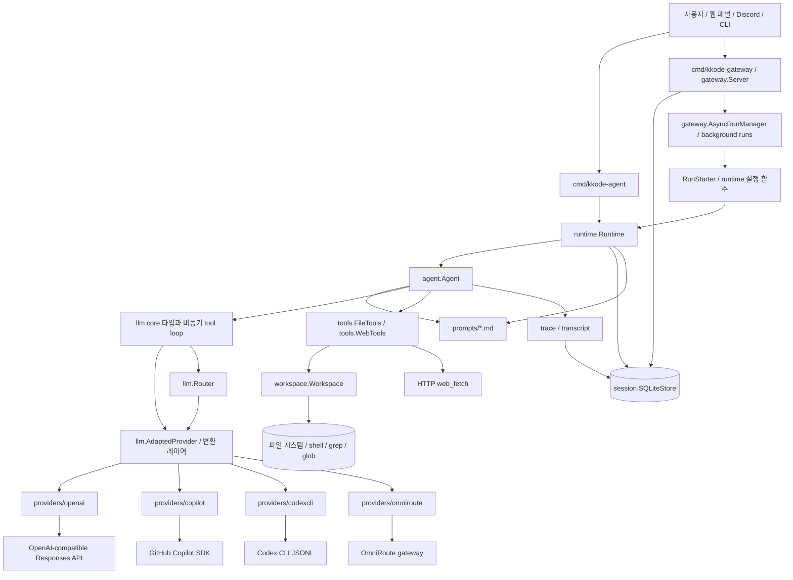
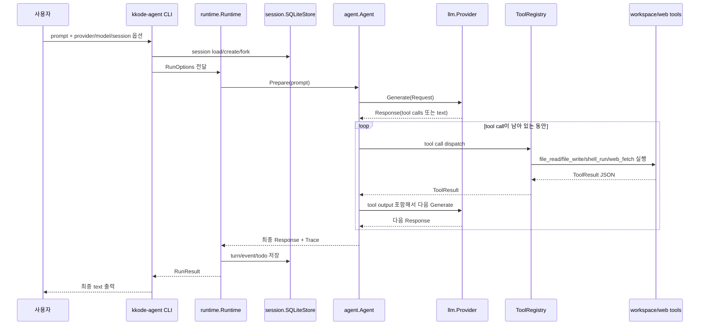
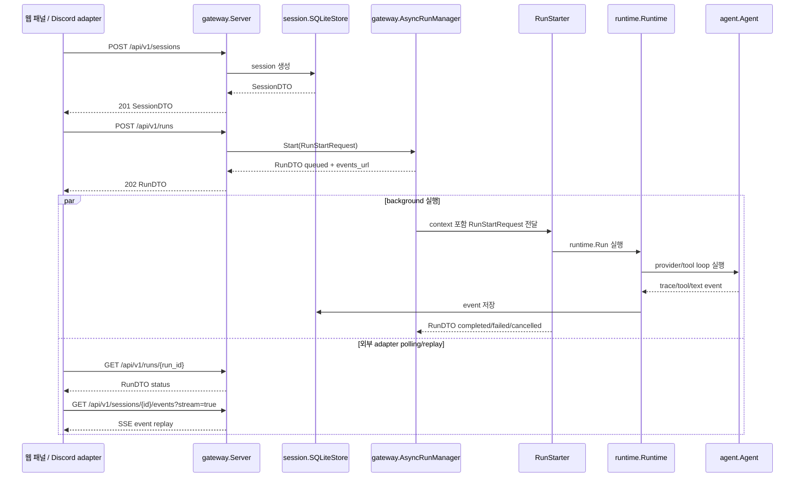
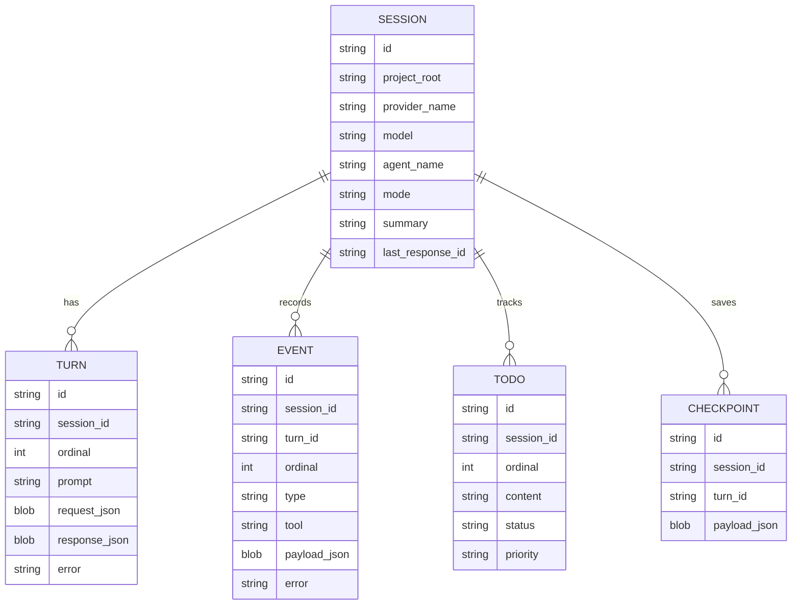

# kkode

`kkode`는 Go로 만드는 바이브코딩 앱의 provider 런타임 기반이에요. 목표는 OpenAI, GitHub Copilot SDK, Codex CLI, OmniRoute 같은 서로 다른 provider를 하나의 공통 타입 체계로 묶는 거예요.

기본 호환 기준은 **OpenAI Responses API**로 잡았어요. 그래서 단순 chat message만 다루지 않고 reasoning item, tool call, tool output, provider raw item을 최대한 보존해요. 이렇게 해야 tool loop, account rotation, Copilot/Codex 같은 agent runtime을 같은 앱 안에서 안전하게 이어 붙일 수 있어요.

## 코드 구조 한눈에 보기

`kkode`의 현재 디렉터리는 대략 이렇게 나뉘어요.

- `app/` — provider spec, converter, 기본 request, default MCP, project instruction 조립
- `agent/` — 실제 tool loop, guardrail, trace, OTel
- `runtime/` + `session/` — run/session 저장, resume/fork, checkpoint, artifact, todo
- `gateway/` — 스트리밍 코딩 에이전트를 위한 HTTP API (sessions, runs, providers, models)
- `workspace/` — 파일 시스템 작업, checkpoint, glob/grep, shell command 실행
- `tools/` — 표준 file/web/codeintel tool 이름과 JSON handler 어댑터
- `llm/` — provider-neutral core request/response/type/pipeline
- `providers/` — openai/copilot/codexcli/omniroute/httpjson adapter
- `cmd/kkode-agent`, `cmd/kkode-gateway` — CLI와 gateway 진입점
- `prompts/` — system/session/todo prompt 템플릿
- `transcript/` — transcript 저장소
- `scripts/`, `research/`, `suggest/` — 검증, 조사, 로드맵 문서


## 프로젝트 틀과 작동 플로우

`kkode`의 큰 틀은 **OpenAI-compatible core → provider adapter → agent runtime → session/gateway surface** 순서로 흘러가요. CLI, 웹 패널, Discord 같은 외부 인터페이스는 모두 같은 runtime과 SQLite session store를 공유하도록 설계해요.

### 전체 구성 그래프


```mermaid
graph TD
    User[사용자 / 웹 패널 / Discord / CLI] --> CLI[cmd/kkode-agent]
    User --> GW[cmd/kkode-gateway / gateway.Server]

    CLI --> RT[runtime.Runtime]
    GW --> Store[(session.SQLiteStore)]
    GW --> RunManager[gateway.AsyncRunManager / background runs]
    RunManager --> RunStarter[RunStarter / runtime 실행 함수]
    RunStarter --> RT

    RT --> Agent[agent.Agent]
    RT --> Store
    Agent --> PromptTemplates[prompts/*.md]
    RT --> PromptTemplates
    Agent --> Core[llm core 타입과 비동기 tool loop]
    Core --> Convert[llm.AdaptedProvider / 변환 레이어]
    Agent --> Tools[tools.FileTools / tools.WebTools]
    Tools --> WS[workspace.Workspace]
    WS --> FS[(파일 시스템 / shell / grep / glob)]
    Tools --> Web[HTTP web_fetch]

    Core --> Router[llm.Router]
    Router --> Convert
    Convert --> OpenAI[providers/openai]
    Convert --> Copilot[providers/copilot]
    Convert --> Codex[providers/codexcli]
    Convert --> OmniRoute[providers/omniroute]

    OpenAI --> ModelAPI[OpenAI-compatible Responses API]
    Copilot --> CopilotSDK[GitHub Copilot SDK]
    Codex --> CodexCLI[Codex CLI JSONL]
    OmniRoute --> OmniRouteAPI[OmniRoute gateway]

    Agent --> Trace[trace / transcript]
    Trace --> Store
```

### Agent 실행 플로우


```mermaid
sequenceDiagram
    participant U as 사용자
    participant C as kkode-agent CLI
    participant R as runtime.Runtime
    participant S as session.SQLiteStore
    participant A as agent.Agent
    participant P as llm.Provider
    participant T as ToolRegistry
    participant W as workspace/web tools

    U->>C: prompt + provider/model/session 옵션
    C->>S: session load/create/fork
    C->>R: RunOptions 전달
    R->>A: Prepare(prompt)
    A->>P: Generate(Request)
    P-->>A: Response(tool calls 또는 text)

    loop tool call이 남아 있는 동안
        A->>T: tool call dispatch
        T->>W: file_read/file_write/shell_run/web_fetch 실행
        W-->>T: ToolResult JSON
        T-->>A: ToolResult
        A->>P: tool output 포함해서 다음 Generate
        P-->>A: 다음 Response
    end

    A-->>R: 최종 Response + Trace
    R->>S: turn/event/todo 저장
    R-->>C: RunResult
    C-->>U: 최종 text 출력
```

### Gateway / 외부 연동 플로우


```mermaid
sequenceDiagram
    participant UI as 웹 패널 / Discord adapter
    participant G as gateway.Server
    participant S as session.SQLiteStore
    participant M as gateway.AsyncRunManager
    participant RS as RunStarter
    participant R as runtime.Runtime
    participant A as agent.Agent

    UI->>G: POST /api/v1/sessions
    G->>S: session 생성
    S-->>G: SessionDTO
    G-->>UI: 201 SessionDTO

    UI->>G: POST /api/v1/runs
    G->>M: Start(RunStartRequest)
    M-->>G: RunDTO queued + events_url
    G-->>UI: 202 RunDTO

    par background 실행
        M->>RS: context 포함 RunStartRequest 전달
        RS->>R: runtime.Run 실행
        R->>A: provider/tool loop 실행
        A-->>R: trace/tool/text event
        R->>S: event 저장
        RS-->>M: RunDTO completed/failed/cancelled
    and 외부 adapter polling/replay
        UI->>G: GET /api/v1/runs/{run_id}
        G-->>UI: RunDTO status
        UI->>G: GET /api/v1/sessions/{id}/events?stream=true
        G-->>UI: SSE event replay
    end
```

### 저장되는 상태


```mermaid
erDiagram
    SESSION ||--o{ TURN : has
    SESSION ||--o{ EVENT : records
    SESSION ||--o{ TODO : tracks
    SESSION ||--o{ CHECKPOINT : saves

    SESSION {
        string id
        string project_root
        string provider_name
        string model
        string agent_name
        string mode
        string summary
        string last_response_id
    }
    TURN {
        string id
        string session_id
        int ordinal
        string prompt
        blob request_json
        blob response_json
        string error
    }
    EVENT {
        string id
        string session_id
        string turn_id
        int ordinal
        string type
        string tool
        blob payload_json
        string error
    }
    TODO {
        string id
        string session_id
        int ordinal
        string content
        string status
        string priority
    }
    CHECKPOINT {
        string id
        string session_id
        string turn_id
        blob payload_json
    }
```

요약하면, 모델별 차이는 `providers/*`에 가두고, 앱의 나머지 부분은 `llm.Request`, `llm.Response`, `ToolCall`, `session.Event` 같은 공통 타입만 보게 해요. 그래서 나중에 Copilot, Codex, OpenAI, OmniRoute, 자체 gateway provider를 바꿔 끼워도 agent/session/gateway 플로우는 유지돼요.

## 지금 구현된 것

### 앱 조립: `app/`

- `app.ProviderSpecs`, `app.BuildProvider`, `app.RegisterHTTPJSONProvider`, `app.BuildHTTPJSONProviderAdapter`, `app.NewWorkspace`, `app.NewAgent`, `app.NewRuntime`, `tools.StandardTools`가 CLI/gateway의 중복 조립 코드를 줄여요. Provider spec에는 converter/caller/source/operation/HTTP route 변환 profile도 들어 있어서 외부 패널이 provider가 어떤 방식으로 실행되는지 discovery할 수 있어요.
- `app.DefaultProviderOptions`가 Serena와 Context7 MCP를 기본 provider option으로 합쳐요. `ProviderHandle.BaseRequest`는 OpenAI-compatible HTTP MCP를 built-in `mcp` tool로 전달하고, Copilot은 stdio/http MCP를 SDK session config로 전달해요. `MCPToolsFromProviderOptions`는 같은 manifest에서 OpenAI-compatible hosted MCP tool과 local `mcp_call` toolset을 함께 만들어서 provider 기본 request와 agent local MCP surface가 서로 다른 설정을 보지 않게 해요. `KKODE_DEFAULT_MCP=off`로 끌 수 있고, `KKODE_SERENA_COMMAND`, `KKODE_SERENA_ARGS`, `KKODE_CONTEXT7_URL`, `CONTEXT7_API_KEY`로 실행 환경에 맞게 바꿀 수 있어요.
- agent 표면에는 표준 `file_*`, `shell_run`, `web_fetch` tool만 붙이고, 이전 `workspace_*` tool 자동 주입은 하지 않아요.

### Prompt 템플릿: `prompts/`

- `agent-system.md`, `session-summary-context.md`, `session-compaction.md`, `todo-instructions.md`를 파일로 관리해요.
- `prompts.Render`가 Go `text/template` 기반으로 system prompt, session 압축 요약, todo 지침을 렌더링하고 template parse 결과를 캐시해요.
- prompt 문구는 코드가 아니라 `prompts/*.md`를 수정해서 바꿀 수 있어요.

### Agent runtime: `agent/`

- `agent.Agent`가 provider, 표준 tool, guardrail, transcript, trace event를 묶어서 실제 coding agent loop를 실행해요. Guardrail은 substring 차단뿐 아니라 `GuardrailPolicy`와 `JSONRequiredFieldsPolicy`로 adapter별 출력 schema/policy 검사를 붙일 수 있고, `OTelObserver`/`GlobalOTelObserver`로 trace event를 OpenTelemetry span으로 내보낼 수 있어요.
- `session.SQLiteStore`와 `runtime.Runtime`이 session resume/fork, turn/event/todo 저장을 담당해요.
- OpenAI-compatible Responses tool loop를 기본으로 쓰고, provider별 adapter는 `llm.Provider`만 구현하면 붙일 수 있어요.
- `cmd/kkode-agent` CLI로 prompt, provider, model, workspace root, session ID를 넘겨 바로 실행할 수 있어요.
- `gateway.Server`와 `cmd/kkode-gateway`가 session/run/event/todo를 HTTP API로 노출해서 웹 패널이나 Discord adapter가 같은 runtime state를 재사용할 수 있게 해요. Todo는 조회뿐 아니라 replace/upsert/delete도 API로 조정할 수 있어요.

### Core: `llm/`

- `Provider`, `StreamProvider`, `SessionProvider`를 제공해요.
- `Request`, `Response`, `Message`, `Item`으로 provider 공통 입출력을 표현해요.
- `RequestConverter`, `ResponseConverter`, `ProviderCaller`, `ProviderStreamCaller`, `ProviderPipeline`, `AdaptedProvider`로 `요청 DTO → provider별 변환 → API/source 호출 → 표준 응답/stream` 흐름을 재사용해요. `ProviderPipeline.Prepare/Call/Decode`를 따로 쓸 수 있어서 preview API, debug UI, 실제 실행이 같은 변환 규칙을 공유해요. 새 provider는 표준 `llm.Request`를 직접 오염시키지 말고 converter와 caller를 추가하는 방향으로 붙이면 돼요. 양방향 `Converter` 하나를 써도 되고 request/response converter를 분리해 OpenAI-compatible 요청 builder, 다른 API caller, 별도 response parser를 조합해도 돼요. Streaming source는 request converter와 stream caller만으로 붙일 수 있어요. OpenAI-compatible HTTP source는 `app.RegisterHTTPJSONProvider`로 source 설정만 등록해도 되고, 더 특수한 provider는 `app.RegisterProvider`로 spec/conversion/factory를 등록해서 core registry를 직접 수정하지 않고 추가할 수 있어요.
- `Tool`, `ToolCall`, `ToolResult`, `ToolRegistry`, `ToolMiddleware`, `RunToolLoop`로 tool 실행 루프를 처리해요. 여러 tool call은 옵션이 켜져 있으면 상한 안에서 비동기로 실행하고 결과 순서는 보존해요.
- `ReasoningConfig`, `ReasoningItem`으로 thinking/reasoning 정보를 보존해요.
- `TextFormat`으로 structured output 설정을 표현해요.
- `Auth`, `Model`, `ModelRegistry`, `Usage.EstimatedCost`를 제공해요.
- `ToolRegistry.WithMiddleware`로 tracing, timeout, metric, redaction 같은 tool 실행 전후 처리를 agent와 gateway가 같은 방식으로 감쌀 수 있어요.
- `Router`, `Template`, `RedactSecrets`도 포함해요.

### Providers

- `providers/openai`
  - OpenAI-compatible `/v1/responses` provider예요.
  - `ResponsesConverter`가 표준 request/response와 Responses payload 사이를 변환하고, `Client`가 API caller/stream caller 역할을 해요.
  - SSE streaming도 같은 변환 레이어를 거쳐서 retry/backoff, built-in tool helper, response parsing을 제공해요.
  - `providers/internal/httptransport`의 JSON request/header/retry/SSE framing helper를 써서 파생 provider와 HTTP 처리 방식을 공유해요. SSE event data도 event당 최대 4194304 byte envelope 안에서만 조립해요.
- `providers/copilot`
  - GitHub Copilot SDK session adapter예요.
  - `SessionConverter`가 표준 request를 SDK session prompt payload로 바꾸고, `Client`가 SDK caller 역할을 해요.
  - session, streaming event 변환도 공통 `AdaptedProvider` 경로로 처리하고, custom tool, MCP/custom agent/skill mapping을 제공해요. `AgentFromConfig`와 `CustomAgentConfigFromAgentConfig`로 provider-neutral `agent.Config`를 Copilot custom agent 정의로 재사용할 수 있어요.
  - SDK session send에서 누적하는 final response text는 최대 8388608 byte envelope로 제한해요.
- `providers/codexcli`
  - `codex exec --json` subprocess adapter예요.
  - `ExecConverter`가 표준 request를 CLI prompt 실행 payload로 바꾸고, `Client`가 subprocess caller 역할을 해요.
  - 단발 응답과 JSONL stream 모두 `ExecConverter`를 먼저 거친 뒤 `llm.StreamEvent`로 바꿔요.
  - 단발 output 파일과 streaming 누적 response text는 각각 최대 8388608 byte envelope로 제한해요.
- `providers/omniroute`
  - OmniRoute gateway adapter예요.
  - `/v1/responses` 또는 OpenAPI 기준 `/api/v1/responses`를 사용할 수 있어요.
  - generation은 `providers/openai`를 감싸고, management/A2A 호출은 같은 내부 HTTP transport helper를 써요.
  - model list, health, thinking budget, fallback chain, cache/rate/session, translator, A2A helper를 제공해요.
  - A2A artifact text는 최대 8388608 byte envelope 안에서만 합쳐요.

### Gateway API: `gateway/`

- `gateway.Server`는 `net/http` 기반 API server예요. 외부 의존성 없이 `/api/v1` REST surface를 만들어요. 스트리밍 코딩 에이전트를 위한 핵심 API만 유지하고 있어요.
- `GET /healthz`, `GET /readyz`, `GET /api/v1`을 제공해요.
- **Providers**: `GET /api/v1/providers`, `GET /api/v1/providers/{provider}`, `POST /api/v1/providers/{provider}/test`는 provider alias, 모델 catalog, 기본 모델, capability, auth 상태를 제공해요. provider test는 기본적으로 live 호출 없이 변환 preview만 반환하고 `live=true`일 때만 실제 provider smoke를 실행해요.
- **Models**: `GET /api/v1/models`은 provider별 모델 catalog를 반환해요.
- **Sessions**: `POST /api/v1/sessions`, `GET /api/v1/sessions`, `GET /api/v1/sessions/{id}`는 session 생성, 목록, 조회예요. session 목록은 `project_root`, `provider`, `model`, `mode`, `limit`, `offset`으로 필터링할 수 있어요.
- **Runs**: `POST /api/v1/runs`, `GET /api/v1/runs`, `GET /api/v1/runs/{id}`, `POST /api/v1/runs/{id}/cancel`, `GET /api/v1/runs/{id}/events`, `GET /api/v1/runs/{id}/transcript`, `POST /api/v1/runs/{id}/retry`를 제공해요. run은 background에서 agent를 실행하고, `events?stream=true`로 SSE streaming을 지원해요. run 시작 시 `Idempotency-Key`로 중복 생성을 방지하고, `request_id`로 추적할 수 있어요.
- 모든 gateway 응답은 `X-Request-Id`를 보존하거나 생성하고, 실패 응답은 `ErrorEnvelope{error:{code,message,request_id,details}}` 형태로 반환해요. `KKODE_CORS_ORIGINS`로 CORS를 설정할 수 있어요.

### App support

- `cmd/kkode-agent`
  - OpenAI, OmniRoute, Copilot SDK, Codex CLI provider를 같은 CLI에서 실행해요.
  - 즉시 실행형 workspace라 파일 쓰기와 shell 실행을 바로 열어요.
  - 기본적으로 `.kkode/state.db` SQLite DB에 session/turn/event/todo를 저장하고, `-session`, `-fork-session`, `-list-sessions`로 이어갈 수 있어요.
- `session`
  - SQLite 기반 session store, resume/fork, turn/event/todo/checkpoint 저장 인터페이스를 제공해요.
- `runtime`
  - `agent.Agent`와 `session.Store`를 묶어 multi-turn runtime을 실행해요.
- `tools`
  - agent가 바로 쓰기 좋은 표준 tool 이름을 제공해요: `file_read`, `file_write`, `file_delete`, `file_move`, `file_edit`, `file_apply_patch`, `file_restore_checkpoint`, `file_prune_checkpoints`, `file_list`, `file_glob`, `file_grep`, `shell_run`, `web_fetch`.
  - `web_fetch`는 HTTP/HTTPS URL을 가져와 status, content type, body, truncate 여부를 JSON으로 돌려주고 UTF-8 안전 경계에서 body를 잘라요.
- `workspace`
  - workspace path boundary, read-range/write/replace/apply-patch/list/glob/grep/search/shell tool을 제공해요.
  - shell 실행은 stdout 문자열뿐 아니라 exit code, stderr, timeout 여부를 구조화해서 tool output으로 돌려줘요.
- `transcript`
  - request/response/error turn을 최대 8388608 byte JSON 파일로 저장하고, 그보다 큰 transcript load/save는 거부해요.
  - secret redaction 저장도 지원해요.

## Agent CLI 예제

기본 실행 모드로 저장소를 조사하거나 수정하게 할 때는 이렇게 실행해요.

```bash
go run ./cmd/kkode-agent \
  -provider openai \
  -model gpt-5-mini \
  -root . \
  "이 저장소 구조를 요약해줘"
```

이 프로젝트는 별도 권한/읽기 전용 모드를 두지 않아요. agent가 요청한 파일 작업과 shell 실행은 workspace root 안에서 바로 실행돼요.

Codex 구독/CLI adapter를 쓰는 경우에는 provider만 바꾸면 돼요.

```bash
go run ./cmd/kkode-agent \
  -provider codex \
  -model gpt-5.3-codex \
  -root . \
  "README.md의 개선점을 알려줘"
```

저장된 session은 이렇게 이어가요.

```bash
go run ./cmd/kkode-agent -list-sessions
go run ./cmd/kkode-agent \
  -session sess_... \
  -provider codex \
  -model gpt-5.3-codex \
  "이전 맥락을 이어서 다음 작업을 해줘"
```

실험 branch처럼 대화를 분기하려면 이렇게 해요.

```bash
go run ./cmd/kkode-agent \
  -fork-session sess_... \
  -fork-at turn_... \
  "이 지점부터 다른 접근으로 구현해줘"
```


## Gateway API 예제

로컬 웹 패널이나 Discord adapter가 session state를 읽게 하려면 gateway를 실행해요. 기본 listen 주소는 localhost라 개발 중에는 안전하게 시작할 수 있어요. `/readyz`는 SQLite store ping과 run starter/previewer/validator/provider tester와 run 조회/취소/event stream wiring을 함께 확인해서 배포 readiness probe로 쓸 수 있고, health/ready 응답은 OpenAPI DTO로 고정돼요. `/api/v1/diagnostics.state_disk`는 `-state` DB가 있는 filesystem의 여유 공간을 보고, 기본 100MiB보다 낮으면 warning으로 표시해요. 이 기준은 `KKODE_MIN_STATE_FREE_BYTES` 또는 `-min-state-free-bytes`로 조절하고 0이면 비활성화해요.

```bash
go run ./cmd/kkode-gateway \
  -addr 127.0.0.1:41234 \
  -state .kkode/state.db
```

로컬 gateway bootstrap 계약만 빠르게 확인하려면 smoke script를 실행해요.

```bash
./scripts/gateway-smoke.sh
```

원격 bind는 file/shell/web tool surface를 외부에 여는 것이므로 API key가 필요해요.

```bash
KKODE_API_KEY=kk_live_local \
KKODE_CORS_ORIGINS=https://panel.example \
KKODE_ACCESS_LOG=1 \
  go run ./cmd/kkode-gateway \
  -addr 0.0.0.0:41234 \
  -api-key-env KKODE_API_KEY
```

별도 웹 패널 origin이 있으면 `KKODE_CORS_ORIGINS` 또는 `-cors-origins`에 쉼표로 나열해요. gateway는 `X-Request-Id`와 `Idempotency-Key` 요청 header를 CORS preflight에서 허용하고 `X-Request-Id`와 `X-Idempotent-Replay`를 CORS exposed header로 열어 브라우저 패널이 요청 추적과 idempotency replay 여부를 읽게 해요. 실제 API 호출은 여전히 bearer token을 써야 해요. 외부 adapter가 `X-Request-Id`를 보내면 gateway가 그대로 응답 header와 오류 body에 보존하고, 없으면 `req_...` 형식으로 생성해요. 128 byte를 넘는 `X-Request-Id`는 응답 header에 그대로 반사하지 않고 새 request id가 붙은 400 오류로 거부해요. Background run을 시작하거나 retry할 때도 같은 값이 run metadata의 `request_id`에 들어가서 run event replay에서 추적할 수 있어요. `KKODE_ACCESS_LOG=1` 또는 `-access-log`를 켜면 request id, method, path, status, byte 수, duration을 JSONL로 stderr에 남겨요. `KKODE_MAX_BODY_BYTES` 또는 `-max-body-bytes`는 JSON API 요청 body 최대 크기를 조절해요. `KKODE_MAX_ITERATIONS`/`-max-iterations`는 128 이하, `KKODE_WEB_MAX_BYTES`/`-web-max-bytes`는 8388608 byte 이하로 제한돼요. `KKODE_READ_HEADER_TIMEOUT`, `KKODE_READ_TIMEOUT`, `KKODE_WRITE_TIMEOUT`, `KKODE_IDLE_TIMEOUT`, `KKODE_SHUTDOWN_TIMEOUT` 또는 대응 flag로 HTTP timeout을 배포 환경에 맞게 조절해요. `cmd/kkode-gateway`는 SIGINT/SIGTERM을 받으면 진행 중 HTTP 요청을 위해 graceful shutdown을 시도하고, 소유 중인 background run도 취소 상태로 저장해요.

배포마다 OpenAI-compatible proxy나 사내 gateway가 다르면 `KKODE_HTTPJSON_PROVIDERS`에 JSON을 넣어 재컴파일 없이 provider를 추가할 수 있어요. 등록된 provider는 `/api/v1/providers`, `/api/v1/models`, session 생성, run preview/test에서 기본 provider와 같은 방식으로 보여요. `max_response_bytes`를 넣으면 해당 HTTP JSON source의 success/error response body 상한을 조절할 수 있고, 생략하면 기본 32MiB를 쓰며 32MiB를 넘는 값은 시작 시 거부해요. 잘린 response/error body는 UTF-8 안전 byte 경계를 보존해요. 이 상한은 `/capabilities.limits.max_http_json_response_bytes`로도 노출돼요.

```bash
export MY_GATEWAY_API_KEY=sk-live-...
export KKODE_HTTPJSON_PROVIDERS='[{"name":"my-gateway","aliases":["my-openai-compatible"],"profile":"openai-compatible","default_model":"gpt-5-mini","auth_env":["MY_GATEWAY_API_KEY"],"base_url":"https://api.example.com/v1","api_key_env":["MY_GATEWAY_API_KEY"],"max_response_bytes":33554432,"source":"my-http-json-gateway"}]'

go run ./cmd/kkode-gateway -addr 127.0.0.1:41234
```

session 생성 예시는 다음과 같아요.

```bash
curl -X POST http://127.0.0.1:41234/api/v1/sessions \
  -H 'Content-Type: application/json' \
  -d '{"project_root":"/home/user/kkode","provider":"openai","model":"gpt-5-mini","agent":"web-panel"}'
```

모델 선택 UI는 model catalog API를 먼저 읽으면 돼요.

```bash
curl 'http://127.0.0.1:41234/api/v1'
curl 'http://127.0.0.1:41234/api/v1/openapi.yaml'
curl 'http://127.0.0.1:41234/api/v1/models?provider=openai'
curl 'http://127.0.0.1:41234/api/v1/prompts'
```

저장해둔 MCP server, skill, subagent manifest를 골라 background run에 붙일 수 있어요. 응답은 즉시 `202 Accepted`와 `run_id`를 돌려주고, 실제 agent 실행은 gateway 내부 goroutine에서 이어져요.

```bash
curl -X POST http://127.0.0.1:41234/api/v1/runs \
  -H 'Content-Type: application/json' \
  -d '{
    "session_id":"sess_...",
    "prompt":"이 저장소 구조를 요약하고 다음 작업을 추천해줘",
    "provider":"copilot",
    "model":"gpt-5-mini",
    "mcp_servers":["mcp_..."],
    "skills":["skill_..."],
    "subagents":["subagent_..."],
    "metadata":{"source":"web-panel"}
  }'
```

run 상태와 상태 변경 SSE는 아래처럼 읽어요. `events_url`은 run event replay URL이라서 외부 패널이 그대로 따라가면 돼요.

```bash
curl http://127.0.0.1:41234/api/v1/runs/run_...
curl 'http://127.0.0.1:41234/api/v1/runs/run_.../events?after_seq=0&limit=200'
curl -N 'http://127.0.0.1:41234/api/v1/runs/run_.../events?stream=true&after_seq=0'
curl -X POST http://127.0.0.1:41234/api/v1/mcp/servers/mcp_.../tools/echo/call \
  -H 'Content-Type: application/json' \
  -d '{"arguments":{"text":"ping"}}'
curl -X POST http://127.0.0.1:41234/api/v1/tools/call \
  -H 'Content-Type: application/json' \
  -d '{"project_root":"/home/user/kkode","tool":"file_read","arguments":{"path":"README.md","offset_line":1,"limit_lines":40}}'
curl 'http://127.0.0.1:41234/api/v1/files?project_root=/home/user/kkode&path=.'
curl 'http://127.0.0.1:41234/api/v1/files/content?project_root=/home/user/kkode&path=README.md&offset_line=1&limit_lines=40'
curl -X POST http://127.0.0.1:41234/api/v1/sessions/sess_.../todos \
  -H 'Content-Type: application/json' \
  -d '{"content":"웹 패널에서 상태를 확인해요","status":"in_progress"}'
curl -X POST http://127.0.0.1:41234/api/v1/sessions/sess_.../checkpoints \
  -H 'Content-Type: application/json' \
  -d '{"turn_id":"turn_...","payload":{"summary":"복구 지점이에요"}}'
curl 'http://127.0.0.1:41234/api/v1/sessions/sess_.../turns?limit=50'
curl http://127.0.0.1:41234/api/v1/sessions/sess_.../events
curl -N 'http://127.0.0.1:41234/api/v1/sessions/sess_.../events?stream=true&after_seq=0'
```

OpenAPI 계약은 `gateway/openapi.yaml`을 참고해요. `go test ./gateway`에는 feature catalog endpoint가 OpenAPI paths와 `/api/v1` bootstrap operations에 계속 존재하는지 확인하는 계약 테스트도 들어 있어요.

## 빠른 검증

```bash
go test ./...
go vet ./...
```

추가 smoke test는 이렇게 실행해요.

```bash
./scripts/verify-go-examples.sh
./scripts/copilot-smoke.sh gpt-5-mini       # Copilot auth가 없으면 SKIP 처리해요
./scripts/copilot-tool-smoke.sh gpt-5-mini  # Copilot auth가 없으면 SKIP 처리해요
./scripts/codexcli-smoke.sh gpt-5.3-codex   # Codex CLI auth/cache가 준비되지 않으면 SKIP 처리해요
./scripts/omniroute-smoke.sh   # OmniRoute가 안 떠 있으면 SKIP 처리해요
```

OpenAI live test는 `OPENAI_API_KEY`가 있을 때만 실행해야해요.

```bash
OPENAI_API_KEY=... OPENAI_TEST_MODEL=gpt-5-mini go test ./providers/openai -run Live
```

## Provider 변환 파이프라인 예제

새 API를 붙일 때는 `llm.Request`를 바로 외부 API에 넘기지 않고, registry 변환 profile과 source caller를 조합해요. 핵심 흐름은 **요청 → 컨버팅 레이어 → API/SDK/CLI 호출 → 표준 응답**이에요. OpenAI-compatible 파생 API라면 converter는 그대로 재사용하고 `ProviderCaller`만 새로 만들면 돼요.

```go
// myCaller는 HTTP API, SDK, CLI, fake source 어디든 가능해요.
// 해야 할 일은 변환된 ProviderRequest를 받아 ProviderResult를 돌려주는 것뿐이에요.
pipeline, err := app.BuildProviderPipeline("openai-compatible", myCaller, myStreamer)
if err != nil {
    return err
}

preq, err := pipeline.Prepare(ctx, req) // preview/debug UI도 같은 변환 규칙을 써요.
if err != nil {
    return err
}
result, err := pipeline.Call(ctx, preq) // 여기만 provider source 경계예요.
if err != nil {
    return err
}
resp, err := pipeline.Decode(ctx, result)
```

provider source가 작으면 별도 struct 없이 함수 adapter로도 붙일 수 있어요. 이렇게 하면 나중에 어떤 API든 `RequestConverterFunc`, `ProviderCallerFunc`, `ResponseConverterFunc` 세 함수만 추가해서 같은 파이프라인을 재사용해요.

```go
pipeline := llm.ProviderPipeline{
    ProviderName: "my-api",
    RequestConverter: llm.RequestConverterFunc(func(ctx context.Context, req llm.Request, opts llm.ConvertOptions) (llm.ProviderRequest, error) {
        return llm.ProviderRequest{
            Operation: opts.Operation,
            Model:     req.Model,
            Body:      map[string]any{"model": req.Model, "messages": req.Messages},
        }, nil
    }),
    Caller: llm.ProviderCallerFunc(func(ctx context.Context, preq llm.ProviderRequest) (llm.ProviderResult, error) {
        // 여기에서만 실제 API/SDK/CLI 호출을 해요.
        data, err := callMyAPI(ctx, preq.Body)
        if err != nil {
            return llm.ProviderResult{}, err
        }
        return llm.ProviderResult{Provider: "my-api", Model: preq.Model, Body: data}, nil
    }),
    ResponseConverter: llm.ResponseConverterFunc(func(ctx context.Context, result llm.ProviderResult) (*llm.Response, error) {
        return parseMyAPIResponse(result.Body, result.Provider, result.Model)
    }),
    Options: llm.ConvertOptions{Operation: "my-api.generate"},
}
```

OpenAI-compatible HTTP JSON API라면 기본 OpenAI-compatible client도 쓰는 공통 caller를 재사용해요. 새 source는 base URL과 operation route만 넣으면 `요청 → OpenAI-compatible 컨버팅 → HTTP JSON 호출 → 표준 응답` 흐름을 그대로 써요.

```go
caller := httpjson.New(httpjson.Config{
    ProviderName:     "my-openai-compatible",
    BaseURL:          "https://api.example.com/v1",
    APIKey:           os.Getenv("MY_API_KEY"),
    MaxResponseBytes: 32 << 20,
    DefaultOperation: "responses.create",
    Routes: map[string]httpjson.Route{
        "responses.create": {Method: http.MethodPost, Path: "/responses"},
    },
})

pipeline, err := app.BuildProviderPipeline("openai-compatible", caller, nil)
if err != nil {
    return err
}
resp, err := pipeline.Generate(ctx, req)
```

SSE source도 같은 caller를 `Streamer`로 넘기면 raw SSE frame을 `llm.StreamEvent`로 받을 수 있어요. provider별 text delta/tool call 의미 해석이 필요하면 전용 `ProviderStreamCaller`를 추가하면 돼요. `MaxResponseBytes`는 JSON success/error body를 제한하고, 0이면 기본 32MiB 제한을 쓰며 32MiB를 넘는 값은 adapter 생성/등록에서 거부해요. error body는 UTF-8 안전 경계로 잘려 `HTTPError.Body`에 남고, success body가 제한을 넘으면 partial JSON을 파싱하지 않고 실패해요.

고정 `/responses`가 아닌 API도 route template로 처리해요. `Path`와 `Query` 값에는 `{model}`, `{operation}`, `{metadata.key}` 또는 `{key}`를 쓸 수 있고, 값은 `llm.ProviderRequest.Metadata`에서 가져와요. path 값은 자동으로 escape되므로 provider/model 이름에 `/`가 있어도 route가 깨지지 않아요. run/provider preview는 매칭된 route와 resolved path/query를 같이 반환해서 live 호출 전에 source endpoint 조립 문제를 잡게 해요.

```go
caller := httpjson.New(httpjson.Config{
    ProviderName:     "templated-api",
    BaseURL:          "https://api.example.com",
    DefaultOperation: "model.generate",
    Routes: map[string]httpjson.Route{
        "model.generate": {
            Method: http.MethodPost,
            Path:   "/v1/providers/{provider}/models/{model}/generate",
            Query:  map[string]string{"api-version": "{metadata.api_version}"},
        },
    },
})

preq := llm.ProviderRequest{
    Operation: "model.generate",
    Model:     "claude/sonnet",
    Body:      map[string]any{"prompt": "안녕"},
    Metadata:  map[string]string{"provider": "anthropic", "api_version": "2026-05-07"},
}
result, err := caller.CallProvider(ctx, preq)
```

`llm.Provider` 구현체가 필요하면 같은 registry를 이렇게 감싸요.

```go
provider, err := app.BuildProviderAdapter("openai", app.ProviderAdapterOptions{
    Caller:       myCaller,
    Streamer:     myStreamer,
    Capabilities: llm.Capabilities{Tools: true, Streaming: true},
})
```

OpenAI-compatible HTTP JSON source는 더 짧게 붙일 수도 있어요. registry에 저장된 `/responses` route를 기본값으로 쓰기 때문에 새 API source는 base URL과 인증값만 넘기면 돼요. source가 SSE를 지원하지 않으면 `DisableStreaming: true`로 `streaming` capability를 끌 수 있어요.

```go
provider, err := app.BuildHTTPJSONProviderAdapter("openai-compatible", app.HTTPJSONProviderOptions{
    ProviderName:     "my-openai-compatible",
    BaseURL:          "https://api.example.com/v1",
    APIKey:           os.Getenv("MY_API_KEY"),
    MaxResponseBytes: 32 << 20,
})
if err != nil {
    return err
}

resp, err := provider.Generate(ctx, req)
```

OpenAI-compatible source를 별도 provider 이름으로 discovery와 routing에 노출할 때는 `RegisterHTTPJSONProvider`가 가장 짧아요. 기존 `openai.ResponsesConverter` profile을 재사용하고 base URL/API key/route만 등록하므로 “요청 → 컨버팅 레이어 → API 호출” 경계를 깨지 않아요.

```go
unregister, err := app.RegisterHTTPJSONProvider(app.HTTPJSONProviderRegistration{
    Name:         "my-gateway",
    Aliases:      []string{"my-openai-compatible"},
    Profile:      "openai-compatible",
    DefaultModel: "gpt-5-mini",
    AuthEnv:      []string{"MY_GATEWAY_API_KEY"},
    BaseURL:      "https://api.example.com/v1",
    APIKeyEnv:    []string{"MY_GATEWAY_API_KEY"},
    Source:       "my-http-json-gateway",
    Routes: []app.ProviderRouteSpec{
        {
            Operation: "responses.create",
            Method:    http.MethodPost,
            Path:      "/responses",
            Query:     map[string]string{"trace": "{metadata.trace_id}"},
        },
    },
})
if err != nil {
    return err
}
defer unregister()

handle, err := app.BuildProvider("my-openai-compatible", ".")
if err != nil {
    return err
}
resp, err := handle.Provider.Generate(ctx, req)
```

완전히 별도 provider 이름으로 discovery와 routing에 노출해야 하면 `RegisterProvider`를 써요. 등록 단위는 `ProviderSpec`(이름/alias/model/capability/discovery), `ProviderConversionFactory`(표준 요청을 source 요청으로 바꾸는 변환 profile), 선택적 `ProviderFactory`(환경변수 기반 실제 provider 생성)예요.

```go
unregister, err := app.RegisterProvider(app.ProviderRegistration{
    Spec: app.ProviderSpec{
        Name:         "my-gateway",
        Aliases:      []string{"my-openai-compatible"},
        DefaultModel: "gpt-5-mini",
        Models:       []string{"gpt-5-mini"},
        AuthEnv:      []string{"MY_GATEWAY_API_KEY"},
        Capabilities: llm.Capabilities{Tools: true, StructuredOutput: true}.ToMap(),
        Conversion: app.ProviderConversionSpec{
            RequestConverter:  "openai.ResponsesConverter",
            ResponseConverter: "openai.ResponsesConverter",
            Call:              "httpjson.Caller.CallProvider",
            Source:            "external-http-json",
            Operations:        []string{"responses.create"},
            Routes:            []app.ProviderRouteSpec{{Operation: "responses.create", Method: http.MethodPost, Path: "/responses", Accept: "application/json"}},
        },
    },
    Conversion: func(spec app.ProviderSpec) app.ProviderConversionSet {
        converter := openai.ResponsesConverter{ProviderName: spec.Name}
        return app.ProviderConversionSet{
            RequestConverter:  converter,
            ResponseConverter: converter,
            Options:           llm.ConvertOptions{Operation: "responses.create"},
            StreamOptions:     llm.ConvertOptions{Operation: "responses.create", Stream: true},
        }
    },
})
if err != nil {
    return err
}
defer unregister() // 테스트나 플러그인 종료 시 되돌려요.
```

## OpenAI-compatible 예제

```go
client := openai.New(openai.Config{
    APIKey: os.Getenv("OPENAI_API_KEY"),
    // OmniRoute 같은 파생 provider는 ProviderName으로 stream/response label을 고정할 수 있어요.
    // ProviderName: "my-openai-compatible-gateway",
})

resp, err := client.Generate(ctx, llm.Request{
    Model:        "gpt-5-mini",
    Instructions: "코딩 어시스턴트처럼 답변해요.",
    Messages: []llm.Message{
        llm.UserText("리팩터링 계획을 만들어줘"),
    },
    Reasoning: &llm.ReasoningConfig{
        Effort:  "medium",
        Summary: "auto",
    },
})
if err != nil {
    panic(err)
}
fmt.Println(resp.Text)
```

## Tool 예제

agent에는 기본적으로 표준 tool 이름을 붙이면 좋아요.

```go
ws, err := workspace.New(".")
if err != nil {
    panic(err)
}

toolDefs, toolHandlers := tools.StandardTools(tools.SurfaceOptions{
    Workspace:   ws,
    WebMaxBytes: 1 << 20,
})

ag, err := agent.New(agent.Config{
    Provider:     provider,
    Model:        "gpt-5-mini",
    Tools:        toolDefs,
    ToolHandlers: toolHandlers,
})
```

직접 workspace API를 써도 돼요.

```go
text, err := ws.ReadFileRange("src/main.go", workspace.ReadOptions{
    OffsetLine: 1,
    LimitLines: 80,
})
_ = text

matches, err := ws.Grep("TODO", workspace.GrepOptions{PathGlob: "**/*.go"})
_ = matches

if err := ws.MovePath("notes/draft.md", "notes/final.md", false); err != nil {
    return err
}
if err := ws.DeletePath("notes/old.md", false); err != nil {
    return err
}

result, err := ws.RunDetailed(ctx, "go", []string{"test", "./..."}, workspace.CommandOptions{})
_ = result
```

## Tool loop 예제

```go
registry := llm.ToolRegistry{
    "echo": llm.JSONToolHandler(func(ctx context.Context, in struct {
        Text string `json:"text"`
    }) (string, error) {
        return in.Text, nil
    }),
}

resp, err := llm.RunToolLoop(ctx, client, req, registry, llm.ToolLoopOptions{
    MaxIterations:        8,
    ParallelToolCalls:    true,
    MaxParallelToolCalls: 4,
})
```

## Router 예제

```go
router := llm.NewRouter()
router.Register("openai", openai.New(openai.Config{APIKey: openAIKey}))
router.Register("copilot", copilot.New(copilot.Config{}))
router.Register("codex", codexcli.New(codexcli.Config{Ephemeral: true}))
router.Register("omniroute", omniroute.NewFromGatewayBase("http://localhost:20128", omniroute.Config{}))

resp, err := router.Generate(ctx, llm.Request{
    Model: "omniroute/auto",
    Messages: []llm.Message{
        llm.UserText("이 저장소를 분석하고 다음 작업을 추천해줘"),
    },
})
```

## 문서

- [`ARCHITECTURE.md`](ARCHITECTURE.md) — 파일 트리, 구현체, 함수 시그니처, 예제를 정리해요.
- [`research/`](research/) — 외부 문서 조사와 구현 판단을 저장해요.
- [`research/08-omniroute-provider.md`](research/08-omniroute-provider.md) — OmniRoute API/MCP/A2A/OpenAPI 조사 내용을 정리해요.
- [`research/09-agent-runtime-hardening.md`](research/09-agent-runtime-hardening.md) — 실제 agent 실행을 위한 tool loop, guardrail, trace, workspace 강화 조사 내용을 정리해요.

## 작업 규칙

앞으로 문서와 주석은 한글 해요체로 작성하고 `~해요`, `~할게요`, `~해야해요` 말투를 유지할게요. 기술 용어는 원문을 유지하고, 새 `research/*.md`와 `suggest/*.md` 파일은 numbered-kebab-case 이름을 쓸게요. 의미 있는 작업 단위가 끝나면 테스트를 돌리고 커밋/푸시까지 할게요.
